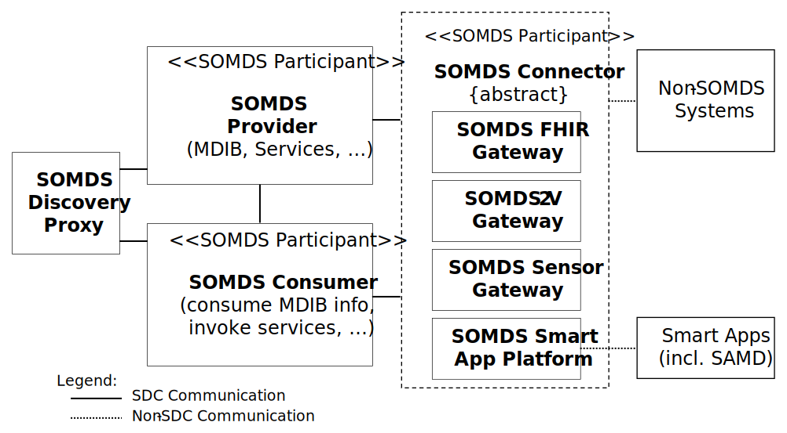

// = Service-oriented Device Point-of-care Interoperability – Plug-and-trust (SDPi-P) Profile

[#vol1_clause_sdpi_p_profile,sdpi_offset=10]
== Service-oriented Device Point-of-care Interoperability – Plug-and-trust (SDPi-P) Profile
[#vol1_clause_sdpi_p_profile_reftext,reftext="SDPi-P Profile"]
The SDPi-Plug-and-trust ([[acronym_sdpi_p,SDPi-P]] SDPi-P) Profile supports foundational seamless connectivity, information exchange and service invocation as defined in the SDPi architecture detailed in <<vol1_clause_sdpi_overview_framework>>.
Whereas the related SDPi Profiles for reporting, alerting and external control are explicitly intended to support medical care capabilities, the SDPi-P Profile focuses on basic healthcare device interoperability.
All the capabilities defined in SDPi-P are leveraged by and extended in the medically focused profiles.
This foundational profile not only supports medical device interoperability ("<<acronym_mdi>>"), providing for “plug-and-play” capabilities, but also with a tightly integrated “trust” framework (see <<vol1_appendix_a_requirements_management_for_p_n_t_interperability>>).
The establishment of a trusted ecosystem of medical and non-medical devices and applications footnote:[Note that SDPi-P supports application interoperability including “Software as a Medical Device” (<<acronym_samd>>).] begins at the start of discovery and a secure connection.  Therefore, the profile's name:  <<term_plug_and_trust>>.

_This_ is primarily an IHE transport profile footnote:[See the IHE Technical Frameworks General Introduction for a more detailed description of IHE profile types, published at https://profiles.ihe.net/GeneralIntro/[profiles.ihe.net/GeneralIntro/].], although it does define several content modules detailed in IHE Devices TF-3.
It supports the transactions and information exchanged in accordance to a Service-Oriented Architecture (SOA) specialized for high-acuity points of care (e.g., operating table or ICU bed), defined as a <<term_service_oriented_medical_device_system>>.
All the SDPi-P actors are therefore scoped with “<<acronym_somds>>” to clearly identify their application context and scope.

Although all information exchanged between SDPi-P <<acronym_somds>> participating systems and applications must conform to the basic <<acronym_sdc>>/<<acronym_biceps>> content module requirements footnote:[See <<vol3_clause_sdc_biceps_semantic_content_module>>. ], content modules have been defined for common high-acuity medical devices such as infusion pumps, ventilators and physiologic monitors.

Note that future IHE _workflow profiles_ may be defined that build upon the transport and content module foundation established by the SDPi-P profile.
For example, Operating Room / Surgery Point-of-Care Integration, ICU Point-of-Care Integration, or more service-focused profiles such as Point-of-Care Identity Management (PCIM) for device-patient association management, or Silent ICU / Quiet Hospital, where the acute point-of-care is integrated with enterprise systems around device alerting and alert distribution to provide an improved environment of care (reduced noise level and improved safety) and clinician interaction.

[#vol1_clause_sdpi_p_actors_transactions_content_modules,sdpi_offset=1]
=== SDPi-P Actors, Transactions, and Content Modules

[%noheader]
[%autowidth]
[cols="1"]
|===
a| *{supplement_note}*: Some actors and transactions have been deferred to a subsequent version, but are included here for completeness.
Specifically:  SOMDS FHIR Gateway, SOMDS Sensor Gateway and SOMDS Smart App Platform, have been deferred.

Deferred transactions have been so indicated in the transactions table.

|===

This section defines the actors, transactions, and/or content modules in this specification.
General definitions of actors are given in the https://profiles.ihe.net/GeneralIntro/ch-A.html[_Technical Frameworks General Introduction Appendix A_]. IHE Transactions can be found in the https://profiles.ihe.net/GeneralIntro/ch-B.html[_Technical Frameworks General Introduction Appendix B_].
Both appendices are located at https://profiles.ihe.net/GeneralIntro/[_profiles.ihe.net/GeneralIntro_].

<<vol1_figure_sdpi_p_actor_diagram>> shows the actors directly involved in the SDPi-P Profile.
The relevant transactions between them are detailed in the subsequent <<vol1_table_sdpi_p_actors_transactions>>.
Abstract actors (i.e., those that provide common specifications that are utilized in other “concrete” or implementation actors) are indicated by stereotype names in italics (e.g., "<< _SOMDS_Participant_ >>". The actors that inherit their capabilities include the stereotype at the top of their actor box.
Alternatively, in accordance with traditional IHE style, the Abstract actor's name can be in italics with "{_abstract_}" (e.g., see _SOMDS Connector_ in <<vol1_figure_sdpi_p_actor_diagram>>).
Actor groupings, including abstract with concrete, are detailed in <<vol1_clause_sdpi_p_required_actor_groupings>>.

[#vol1_figure_sdpi_p_actor_diagram]
.SDPi-P Actor Diagram

<<vol1_table_sdpi_p_actors_transactions>> lists the transactions for each actor directly involved in the SDPi-P Profile.
To claim conformity with this specification, an actor shall support all required transactions (labeled “R”) and may support the optional transactions (labeled “O”).
Note that “Consumer” is indicated for actors that receive but do not directly respond to a specific transaction.

[#vol1_table_sdpi_p_actors_transactions]
.SDPi-P Profile - Actors and Transactions
[%autowidth]
[cols="1,2,1,1,3"]
|===
.^|Actors
.^|Transactions
.^|Initiator or Responder
.^|Optionality
.^|Reference

| <<vol1_spec_sdpi_p_actor_somds_participant>>
| NOTE:  This abstract actor does not define any specific transactions.
| ...
| ...
| ...

.13+| <<vol1_spec_sdpi_p_actor_somds_provider>>
.^| <<transaction_name_announce_network_presence>>
.^| Initiator
.^| R
| <<vol2_clause_dev_23>>

| <<transaction_name_discover_network_topology>>
| Responder
| R
| <<vol2_clause_dev_24>>

| <<transaction_name_discover_biceps_services>>
| Responder
| R
| <<vol2_clause_dev_25>>

| <<transaction_name_discover_system_context_and_capabilities>> (_deferred_)
| Responder
| R
| Deferred to SDPi 1.x
// <<vol2_clause_dev_26>>

| <<transaction_name_manage_biceps_subscription>>
| Responder
| R
| <<vol2_clause_dev_27>>

| <<transaction_name_notify_change_in_system_context_and_capabilities>>
| Initiator
| O ^(See^ ^Note^ ^1)^
| <<vol2_clause_dev_28>>

| <<transaction_name_publish_biceps_update_reports>>
| Initiator
| R
| <<vol2_clause_dev_29>>

| <<transaction_name_retrieve_biceps_content>>
| Responder
| O
| <<vol2_clause_dev_30>>

| <<transaction_name_set_provider_state>> (_deferred_)
| Responder
| O
| Deferred to SDPi-xC
// <<vol2_clause_dev_31>>

| <<transaction_name_retrieve_archive_data>>  (_deferred_)
| Responder
| O
| Deferred to SDPi 1.x
// <<vol2_clause_dev_32>>

| <<transaction_name_retrieve_localization_information>>
| Responder
| O
| Deferred to SDPi 1.x
// <<vol2_clause_dev_33>>

| <<transaction_name_announce_network_departure>>
| Initiator
| R
| <<vol2_clause_dev_34>>

.^| <<transaction_name_update_network_presence>>
.^| Initiator
.^| O   ^(See^ ^Note^ ^2)^
| <<vol2_clause_dev_46>>

.13+| <<vol1_spec_sdpi_p_actor_somds_consumer>>
.^| <<transaction_name_announce_network_presence>>
.^| _Receiver_  ^(See^ ^Note^ ^3)^
.^| O
| <<vol2_clause_dev_23>>

| <<transaction_name_discover_network_topology>>
| Initiator
| R
| <<vol2_clause_dev_24>>

| <<transaction_name_discover_biceps_services>>
| Initiator
| R
| <<vol2_clause_dev_25>>

| <<transaction_name_discover_system_context_and_capabilities>> (_deferred_)
| Initiator
| R
| Deferred to SDPi 1.x
// <<vol2_clause_dev_26>>

| <<transaction_name_manage_biceps_subscription>>
| Initiator
| R
| <<vol2_clause_dev_27>>

| <<transaction_name_notify_change_in_system_context_and_capabilities>>
| _Receiver_  ^(See^ ^Note^ ^3)^
| O
| <<vol2_clause_dev_28>>

| <<transaction_name_publish_biceps_update_reports>>
| _Receiver_  ^(See^ ^Note^ ^3)^
| R
| <<vol2_clause_dev_29>>

| <<transaction_name_retrieve_biceps_content>>
| Initiator
| O
| <<vol2_clause_dev_30>>

| <<transaction_name_set_provider_state>> (_deferred_)
| Initiator
| O
| Deferred to SDPi-xC
// <<vol2_clause_dev_31>>

| <<transaction_name_retrieve_archive_data>>  (_deferred_)
| Initiator
| O
| Deferred to SDPi 1.x
// <<vol2_clause_dev_32>>

| <<transaction_name_retrieve_localization_information>>
| Initiator
| O
| Deferred to SDPi 1.x
// <<vol2_clause_dev_33>>

| <<transaction_name_announce_network_departure>>
| _Receiver_  ^(See^ ^Note^ ^3)^
| O
| <<vol2_clause_dev_34>>

| <<transaction_name_retrieve_network_presence>>
| Initiator
| O   ^(See^ ^Note^ ^2)^
| <<vol2_clause_dev_47>>

.2+| <<vol1_spec_sdpi_p_actor_discovery_proxy>>
.^| <<transaction_name_update_network_presence>>
.^| _Receiver_  ^(See^ ^Note^ ^2)^
.^| R
| <<vol2_clause_dev_46>>

| <<transaction_name_retrieve_network_presence>>
| Responder
| R
| <<vol2_clause_dev_47>>

// FOR THE NEXT ROW:
//     #TODO: TBD HOW TO REPLICATE TRANSACTIONS; ACTOR SUPPORTS ALL PROVIDER & CONSUMER TRANSACTIONS WITH SAME OPTIONALITY#
| <<vol1_spec_sdpi_p_actor_somds_connector>>
| See Note 4
| ...
| ...
| ...

| <<vol1_spec_sdpi_p_actor_somds_fhir_gateway>> (_deferred_)
| ...
| ...
| ...
| ...

// FOR THE NEXT ROW:
//     #TODO: TBD HOW TO REPLICATE TRANSACTIONS#
| <<vol1_spec_sdpi_p_actor_somds_v2_gateway>>
| See Note 4
| ...
| ...
| ...

| <<vol1_spec_sdpi_p_actor_somds_sensor_gateway>> (_deferred_)
| ...
| ...
| ...
| ...

| <<vol1_spec_sdpi_p_actor_somds_smart_app_platform>> (_deferred_)
| ...
| ...
| ...
| ...

5+<|
Note 1: _“Notify Change in System Context and Capabilities”_ is required if there are dynamic changes that may need to be sent to subscribing systems

Note 2: Optional transaction is required if the SDPi-P <<vol1_spec_sdpi_p_option_discovery_proxy>> is enabled.  Some deployments may support a mix of systems that use the <<vol1_spec_sdpi_p_actor_discovery_proxy>> Actor as well as the default "ad hoc" discovery mode.  Additional details and requirements are provided in the <<vol1_clause_sdpi_p_option_discovery_proxy>> discussion.

Note 3: _“Receiver”_ is included in this column, in _italics_, to indicate that though a <<vol1_spec_sdpi_p_actor_somds_consumer>> may "receive" the transaction, there is no response communicated to the message initiator.

Note 4: *_SDPi Version Note:_*  -- Full detailing of the transactions related to this actor will be addressed in a subsequent version of this specification.

|===

<<vol1_figure_sdpi_p_biceps_content_actor_diagram>> shows the content-related actors defined in the SDPi-P Profile and the direction that the content is exchanged.

In general, the <<vol1_spec_sdpi_p_actor_somds_provider>> will create content for consumption by a <<vol1_spec_sdpi_p_actor_somds_consumer>> , but the communication cloud between the two actors indicates that the technical method of exchange is a separate concern for the semantic content.
Within the SDPi-P Profile, the general "default" communication methods would be using the <<acronym_somds>> capabilities illustrated above in <<vol1_figure_sdpi_p_actor_diagram>> with the <<vol1_spec_sdpi_p_actor_biceps_content_creator>> communicating content via the <<vol1_spec_sdpi_p_actor_somds_provider>> , and the <<vol1_spec_sdpi_p_actor_biceps_content_consumer>> receiving it via the <<vol1_spec_sdpi_p_actor_somds_consumer>>.
However, the content might also be formalized in a document as opposed to a message, and a different method of exchange and persistence utilized.

Note that in the case of external control, where a <<vol1_spec_sdpi_p_actor_somds_consumer>> is creating and sending content (e.g., patient demographics information) to a <<vol1_spec_sdpi_p_actor_somds_provider>> , the content module creator / consumer roles will be reversed.

A product implementation using this specification may group from this profile with actors from a workflow or transport profile to be functional.
The grouping of the content module described in this profile to specific actors is described in more detail in <<vol1_clause_sdpi_p_required_actor_groupings>> or in <<vol1_clause_sdpi_p_cross_profile_considerations>>.

[#vol1_figure_sdpi_p_biceps_content_actor_diagram]
.SDPi-P BICEPS Content Actor Diagram

image::../images/vol1-diagram-sdpi-p-content-actor.svg[]

<<vol1_table_sdpi_p_actors_content_modules>> lists the content module(s) defined in the SDPi-P Profile. To claim support with this specification, an actor shall support all required content modules (labeled “R”) and may support optional content modules (labeled “O”).

[#vol1_table_sdpi_p_actors_content_modules]
.SDPi-P -- Actors and Content Modules

[%autowidth]
[cols="1,1,1,1"]
|===
.^|Actors
.^|Content Modules
.^|Optionality
.^|Reference

.7+| <<vol1_spec_sdpi_p_actor_biceps_content_creator>>
| SDC/BICEPS Content Module
| R ^(See^ ^Note^ ^1)^
| <<vol3_clause_sdc_biceps_semantic_content_module>>

| Infusion Pump SDC/BICEPS Content Module
| O
| <<vol3_clause_device_infusion_pump>>

| Ventilator SDC/BICEPS Content Module
| O
| <<vol3_clause_device_ventilator>>

| Physiologic Monitor SDC/BICEPS Content Module
| O
| <<vol3_clause_device_physiological_monitor>>

| Surgery Devices SDC/BICEPS Content Module
| O
| <<vol3_clause_device_surgical>>

| Anesthesia Devices SDC/BICEPS Content Module (_deferred_)
| O
|

| Dialysis Devices SDC/BICEPS Content Module (_deferred_)
| O
|

.7+| <<vol1_spec_sdpi_p_actor_biceps_content_consumer>>
| SDC/BICEPS Content Module
| R ^(See^ ^Note^ ^1)^
| <<vol3_clause_sdc_biceps_semantic_content_module>>

| Infusion Pump SDC/BICEPS Content Module
| O
| <<vol3_clause_device_infusion_pump>>

| Ventilator SDC/BICEPS Content Module
| O
| <<vol3_clause_device_ventilator>>

| Physiologic Monitor SDC/BICEPS Content Module
| O
| <<vol3_clause_device_physiological_monitor>>

| Surgery Devices SDC/BICEPS Content Module
| O
| <<vol3_clause_device_surgical>>

| Anesthesia Devices SDC/BICEPS Content Module (_deferred_)
| O
|

| Dialysis Devices SDC/BICEPS Content Module (_deferred_)
| O
|

4+<|
Note 1: _All content exchanged on a SOMDS shall conform to the general SDPi “BICEPS Content Module” requirements (see <<vol3_clause_sdc_biceps_semantic_content>>).  <<vol1_spec_sdpi_p_actor_somds_provider>>-specific content modules (e.g., infusion pumps) may be optionally supported as indicated._

|===

==== Actor Descriptions and Actor Profile Requirements

SDPi-P actor roles and responsibilities are described in the subsections below.

Unless otherwise specified below, individual transaction requirements are specified in TF-2 <<vol2_clause_transactions>>, and requirements related to content modules are detailed in TF-3 <<vol3_clause_content_modules>>.
This section documents any additional requirements on the profile’s content actors.

<<vol1_figure_sdpi_p_example_sequence_diagram>> illustrates a typical (not comprehensive) exchange scenario between SDPi-P actors:

[#vol1_figure_sdpi_p_example_sequence_diagram]
.SDPi-P Example Sequence Diagram

[plantuml, target=puml-sdpi-p-example-sequence-diagram, format=svg]
....
include::../plantuml/vol1-figure-sdpi-p-example-sequence-diagram.puml[]
....

[#vol1_clause_sdpi_p_somds_participant]
===== SOMDS Participant
[#vol1_spec_sdpi_p_actor_somds_participant, reftext='SOMDS Participant']
Actor Summary Definition:
[none]
. A foundational abstract actor that provides the SOA architectural constructs for interoperating in a Service-Oriented Medical Device System (SOMDS) network instance, including information, messaging and dynamic behavior models.   (See <<ref_ieee_11073_10207_2017>>  “PARTICIPANT” definition)

All systems participating in a SOMDS network instance must implement this Abstract actor.

All SDPi Profiles actors are grouped with (inherit from) this actor, including both transport / transaction actors and content module actors.
This required grouping ensures that all systems connecting to a SOMDS network support the <<acronym_ses_mdi>>  requirements footnote:[See #General Introduction  Appendix A for more detail on <<acronym_ses_mdi>>] necessary for establishing a <<term_plug_and_trust>> ecosystem, including the secure and dynamic provision of an implementation’s <<term_system_function_contribution>>.
See <<vol1_clause_appendix_a_requirements_from_narratives_to_pnt_interfaces>> for additional discussion.

////

#TODO: Do we need to add additional requirements for this actor?  They seem VERY slim.#

////

[#vol1_clause_sdpi_p_somds_provider]
===== SOMDS Provider
[#vol1_spec_sdpi_p_actor_somds_provider, reftext='SOMDS Provider']
Actor Summary Definition:
[none]
. A <<vol1_spec_sdpi_p_actor_somds_participant>> that provides at least one service to the other participant systems.  (See <<ref_ieee_11073_10207_2017>>  “SERVICE PROVIDER” definition.)

Every <<vol1_spec_sdpi_p_actor_somds_provider>> is paired with (inherits from) the abstract _<<vol1_spec_sdpi_p_actor_somds_participant>>_ Actor.

A system that participates in a SOMDS network instance can include both <<vol1_spec_sdpi_p_actor_somds_consumer>> and <<vol1_spec_sdpi_p_actor_somds_provider>> Actors.

[#vol1_clause_sdpi_p_somds_consumer]
===== SOMDS Consumer
[#vol1_spec_sdpi_p_actor_somds_consumer, reftext='SOMDS Consumer']
Actor Summary Definition:
[none]
. A <<vol1_spec_sdpi_p_actor_somds_participant>> that discovers and utilizes at least one service, functional capability, exposed to a network communications backbone by a <<vol1_spec_sdpi_p_actor_somds_provider>>. (See <<ref_ieee_11073_10207_2017>>  “SERVICE CONSUMER” and “SERVICE” definitions.)

Every <<vol1_spec_sdpi_p_actor_somds_consumer>> is paired with (inherits from) the abstract _<<vol1_spec_sdpi_p_actor_somds_participant>>_ Actor.

A system that participates in a SOMDS network instance can include both <<vol1_spec_sdpi_p_actor_somds_consumer>> and <<vol1_spec_sdpi_p_actor_somds_provider>>.

[#vol1_clause_sdpi_p_somds_connector]
===== SOMDS Connector
[#vol1_spec_sdpi_p_actor_somds_connector, reftext='SOMDS Connector']
Actor Summary Definition:
[none]
. A _<<vol1_spec_sdpi_p_actor_somds_participant>>_ that enables seamless interaction with systems and software applications that are outside the scope of the SOMDS network instance.  This abstract actor provides a consistent method for interacting, as a <<vol1_spec_sdpi_p_actor_somds_consumer>> and / or <<vol1_spec_sdpi_p_actor_somds_provider>>, with a specific SOMDS instance, as the foundation for protocol-specific gateway and platform actors.

Every abstract _<<vol1_spec_sdpi_p_actor_somds_connector>>_ is grouped with (inherits from) the abstract _<<vol1_spec_sdpi_p_actor_somds_participant>>_.

A _<<vol1_spec_sdpi_p_actor_somds_connector>>_ can implement both <<vol1_spec_sdpi_p_actor_somds_consumer>> and <<vol1_spec_sdpi_p_actor_somds_provider>>.

In the case of a connector implementing a <<vol1_spec_sdpi_p_actor_somds_consumer>>, it is able to interact with other <<vol1_spec_sdpi_p_actor_somds_provider>>  to either obtain information that is then made available to Non-SOMDS Systems or invoke services that are requested from the external Non-SOMDS Systems.
For example, forwarding patient respiratory rate readings to an external “flow sheet” application or invoking a device’s “pause alert audio” service when a clinician indicates they are responding to a physiological alert condition (e.g., high respiratory rate).

In the case of a connector implementing a <<vol1_spec_sdpi_p_actor_somds_provider>>, service capabilities for interacting with Non-SOMDS Systems are provided to the other networked <<vol1_spec_sdpi_p_actor_somds_consumer>>.
For example, an application that wants to retrieve patient information from an EHR or check the latest patient laboratory results.

Note that the term “connector” is used to allow for SOMDS interaction with other systems that do not require protocol “gateway” adaptation, but do require a consistent interface to the other participants within a SOMDS environment.
See <<vol1_clause_sdpi_p_somds_sensor_gateway>> and <<vol1_clause_sdpi_p_somds_smart_app_platform>> for examples.

Each _<<vol1_spec_sdpi_p_actor_somds_connector>>_ gateway implementation will include the protocol-specific rules for connecting to and interacting with external non-SOMDS Systems, including semantic mappings, message formats, and interaction sequences.
See related discussion at <<vol3_clause_biceps_mapping_using_somds_connector_content_modules>>.

[%noheader]
[%autowidth]
[cols="1"]
|===
a| *{supplement_note}*: The TF-3 SDC/BICEPS Mapping of SOMDS Connector Content Modules section is out-of-scope., but included above for completeness of this actor overview.
|===

Although the SDPi-P Profile _<<vol1_spec_sdpi_p_actor_somds_connector>>_ provides for non-SOMDS _protocol-specific_ adaptors, they establish the foundation for specifying system and application-specific interfaces such as for EHR or decision support systems (e.g., sepsis determination).
////
See <<vol1_clause_sdpi_p_ensuring_time_synchronization>>, and <<vol1_clause_sdpi_p_aggregators_proxies_sensors>> for additional perspectives and concepts on how SOMDS Connectors may be implemented.
////
_<<vol1_spec_sdpi_p_actor_somds_connector>>_ system implementations may support multiple protocols where there is one SOMDS-facing participant model or API but with multiple protocols for non-SOMDS system integration.
For example, a SOMDS “Alert” Gateway would interact with other _<<vol1_spec_sdpi_p_actor_somds_participant>>s_ in a single consistent way but may support both <<ref_hl7_fhir>> and <<ref_hl7_v2>> protocols for interacting with healthcare enterprise systems.

_<<vol1_spec_sdpi_p_actor_somds_connector>>_ may also be utilized in other SDPi Profiles for medical device information reporting (<<acronym_sdpi_r>>), alerting (<<acronym_sdpi_a>>) and external control (<<acronym_sdpi_xc>>). See those profile specifications for detailed usage.  In some cases, https://profiles.ihe.net/[IHE profiles] have been defined for supporting integration with Non-SOMDS Systems, such as the V2-based IHE Devices Device to Enterprise Communication (DEC) profile (See <<ref_ihe_pcd_tf_1_2019>>), or the IHE ITI XDS-I for locating and retrieving images for a specific patient using the XDS.b profile.  In these cases, *_profile-specific_* _<<vol1_spec_sdpi_p_actor_somds_connector>>_ adaptors may be specified as well.

[#vol1_clause_sdpi_p_somds_fhir_gateway]
===== SOMDS FHIR Gateway
[#vol1_spec_sdpi_p_actor_somds_fhir_gateway, reftext='SOMDS FHIR Gateway']
Actor Summary Definition:
[none]
. A _<<vol1_spec_sdpi_p_actor_somds_connector>>_ that supports use of <<ref_hl7_fhir>> for interoperating with Non-SOMDS Systems.

<<vol1_spec_sdpi_p_actor_somds_fhir_gateway>> Actors shall be grouped with (inherit from) the abstract _<<vol1_spec_sdpi_p_actor_somds_connector>>_ Actor.
They shall implement either a <<vol1_spec_sdpi_p_actor_somds_provider>> and / or <<vol1_spec_sdpi_p_actor_somds_consumer>> Actor.

The <<vol1_spec_sdpi_p_actor_somds_fhir_gateway>> actor identifies and specifies the logic necessary for connecting a SOMDS network environment with Non-SOMDS Systems that utilize <<ref_hl7_fhir>> for their interoperability protocol.  Generally, this logic is defined in the HL7 <<ref_hl7_fhir_pocd_ig>>.

Gateways implementing this actor can generally support any of the FHIR architectural approaches:  RESTful, messaging, documents, and SOA - although the primary approaches are RESTful and messaging. A specific <<vol1_spec_sdpi_p_actor_somds_fhir_gateway>> specification in <<vol2_appendix_b_gateways>> will constrain to (a) specific approach(es). To facilitate interoperability, named options may be added to specialized actors to clearly indicate what a given implementation supports.

For example, a <<vol1_spec_sdpi_p_actor_somds_fhir_gateway>> could utilize a <<vol1_spec_sdpi_p_actor_somds_consumer>> to retrieve information from other _<<vol1_spec_sdpi_p_actor_somds_participant>>_ systems, map it into FHIR Bundle resources and forward it on to non-SOMDS systems in a FHIR message.

Alternatively, the <<vol1_spec_sdpi_p_actor_somds_fhir_gateway>> could implement a FHIR server and provide support for systems to discover and retrieve information asynchronously, including the use of FHIR publication / subscription (“pub/sub”) services.

The <<vol1_spec_sdpi_p_actor_somds_fhir_gateway>> could also support SOMDS services invoked by FHIR-based systems, such as requesting a snapshot of the latest vital signs measurements for a specific patient and triggering a blood-pressure cuff reading.

[#vol1_clause_sdpi_p_somds_v2_gateway]
===== SOMDS V2 Gateway
[#vol1_spec_sdpi_p_actor_somds_v2_gateway, reftext='SOMDS V2 Gateway']
Actor Summary Definition:
[none]
. A <<vol1_spec_sdpi_p_actor_somds_connector>> that supports use of <<ref_hl7_v2>> for interoperating with Non-SOMDS Systems.

<<vol1_spec_sdpi_p_actor_somds_v2_gateway>> Actors shall be grouped with (inherit from) the abstract _<<vol1_spec_sdpi_p_actor_somds_connector>>_ Actor.
They shall implement either a <<vol1_spec_sdpi_p_actor_somds_provider>> and / or <<vol1_spec_sdpi_p_actor_somds_consumer>> Actor.

The <<vol1_spec_sdpi_p_actor_somds_v2_gateway>> identifies and specifies the logic necessary for connecting a SOMDS network environment with Non-SOMDS Systems that utilize <<ref_hl7_v2>> for their interoperability protocol.
Since V2 is a message-based protocol, the primary implementation guide logic is defined in <<vol2_clause_appendix_sdpi_gateway_hl7_v2_general_mapping>>.
Additional specifications for semantic content modules is detailed in <<vol3_clause_content_modules>>, including <<vol3_clause_biceps_relationship_to_classic_dim>>.

Generally, the <<vol1_spec_sdpi_p_actor_somds_v2_gateway>> supports messaging from a SOMDS environment to V2-enabled systems, utilizing a <<vol1_spec_sdpi_p_actor_somds_consumer>> to collect information from <<vol1_spec_sdpi_p_actor_somds_provider>> systems and translate them to V2 messages sent to other Non-SOMDS Systems.  There are cases, though, where information may be sent to a SOMDS-based system such as an alert conformation utilizing a [DEV-05] (i.e., [PCD-05]) transaction (see <<vol1_clause_sdpi_a_profile>> below).

[#vol1_clause_sdpi_p_somds_sensor_gateway]
===== SOMDS Sensor Gateway
[%noheader]
[%autowidth]
[cols="1"]
|===
| *{supplement_note}*: Detailed specifications for this actor are deferred to a later version of the SDPi Supplement.
|===

[#vol1_spec_sdpi_p_actor_somds_sensor_gateway, reftext='SOMDS Sensor Gateway']
Actor Summary Definition:
[none]
. A _<<vol1_spec_sdpi_p_actor_somds_connector>>_  that supports integration of sensors external to a SOMDS network.

<<vol1_spec_sdpi_p_actor_somds_sensor_gateway>> Actors shall be grouped with (inherit from) the abstract _<<vol1_spec_sdpi_p_actor_somds_connector>>_. They shall implement either a <<vol1_spec_sdpi_p_actor_somds_provider>> and / or <<vol1_spec_sdpi_p_actor_somds_consumer>> Actor.

The <<vol1_spec_sdpi_p_actor_somds_sensor_gateway>> identifies and specifies the logic necessary for integration of signals and controls from small sensor and actuator devices that do not have the resources to support direct integration into a SOMDS network.
This includes integration of both wired and wireless sensor networks (“WSN”).
This also includes SOMDS integration of IoT (“Internet of Things”) architectures / networks.

[#vol1_clause_sdpi_p_somds_smart_app_platform]
===== SOMDS Smart App Platform
[%noheader]
[%autowidth]
[cols="1"]
|===
| *{supplement_note}*: Detailed specifications for this actor are deferred to a later version of the SDPi Supplement.
|===

[#vol1_spec_sdpi_p_actor_somds_smart_app_platform, reftext='SOMDS Smart App Platform']
Actor Summary Definition:
[none]
. A _<<vol1_spec_sdpi_p_actor_somds_connector>>_  that supports connection to a SOMDS network that is optimized for applications, including <<term_software_as_a_medical_device>>.

<<vol1_spec_sdpi_p_actor_somds_smart_app_platform>> Actors shall be grouped with (inherit from) the abstract _<<vol1_spec_sdpi_p_actor_somds_connector>>_ Actor.
They shall implement either a <<vol1_spec_sdpi_p_actor_somds_provider>> and / or <<vol1_spec_sdpi_p_actor_somds_consumer>> Actor.

This actor leverages the consistent integration of a _<<vol1_spec_sdpi_p_actor_somds_connector>>_ to a SOMDS network environment but provides a simplified platform specification to support “smart apps” including <<term_software_as_a_medical_device>>.
For example, an application may only need to identify and consume a few parameters from one or more _<<vol1_spec_sdpi_p_actor_somds_participant>>_ systems and not be required to implement a complete SOMDS interface including security, discovery, subscription management, filtering of unneeded <<acronym_mdib>> information, etc.

<<vol1_spec_sdpi_p_actor_somds_smart_app_platform>> Actors provide an abstraction layer between application software and the requirements for interoperating in a SOMDS network backbone.
Since a single platform actor can support multiple Smart Apps, network traffic may be significantly reduced, as well as processing overhead for <<vol1_spec_sdpi_p_actor_somds_provider>> systems that have multiple <<vol1_spec_sdpi_p_actor_somds_consumer>>s simultaneously invoking their services.

The platform must support both non-smart app critical functions (such as network topology discovery and maintenance) but also aggregate app requirements (e.g., quality of service necessary to support an application’s algorithms).
////
See <<vol1_clause_smart_app_platforms>> for additional discussion.
////
===== BICEPS Content Creator
[#vol1_spec_sdpi_p_actor_biceps_content_creator, reftext='BICEPS Content Creator']
Actor Summary Definition:
[none]
. Provides <<acronym_mdib>> content conformant to <<ref_ieee_11073_10207_2017>> BICEPS specification and for consumption by other <<vol1_spec_sdpi_p_actor_biceps_content_consumer>> systems.

All content created and provided by a <<vol1_spec_sdpi_p_actor_biceps_content_creator>> shall be conformant to the BICEPS content module specifications in <<vol3_clause_sdc_biceps_semantic_content_module>> and related sections.

Note that although this SDPi-P content actor primarily supports information exchange between systems participating in a SOMDS network environment, they may also be utilized by other non-SDPi profiles that support non-SOMDS exchange architectures, transactions and technologies.

Content is provided by one _<<vol1_spec_sdpi_p_actor_somds_participant>>_ to another.
Typically, this will be a <<vol1_spec_sdpi_p_actor_somds_provider>> system to a <<vol1_spec_sdpi_p_actor_somds_consumer>> system; however, as noted previously, in some cases such as changing configuration settings within a <<vol1_spec_sdpi_p_actor_somds_provider>> (e.g., Patient Context), content creation and provision is from a <<vol1_spec_sdpi_p_actor_somds_consumer>> (initiating the configuration change request) to a <<vol1_spec_sdpi_p_actor_somds_provider>> system.

===== BICEPS Content Consumer
[#vol1_spec_sdpi_p_actor_biceps_content_consumer, reftext='BICEPS Content Consumer']
Actor Summary Definition:
[none]
. Processes <<acronym_mdib>> information conformant to <<ref_ieee_11073_10207_2017>> BICEPS specifications provided by <<vol1_spec_sdpi_p_actor_biceps_content_creator>> systems.

A <<vol1_spec_sdpi_p_actor_biceps_content_consumer>> shall be capable of processing information provided by a <<actor_biceps_content_creator>>, in accordance to the BICEPS content module specifications in <<vol3_clause_sdc_biceps_semantic_content_module>> and related sections.

////

#TODO:  Removed the following line from the paragraph above ... BUT may want to add it in at some point in the future when multiple ways of processing "consumed" content is supported:

The supported BICEPS content processing shall include one or more of the options identified for this actor in <<vol1_table_sdpi_p_actor_options>> below.

////

For robustness, a <<actor_biceps_content_consumer>> need only process the content that is necessary to support its capabilities, but shall also be able to accept and ignore any additional content that may be provided but is out-of-scope for its internal requirements. footnote:[Apply Postel’s Law:  Send conservatively, Accept liberally.]

Note that although this SDPi-P content actor primarily supports information exchange between systems participating in a SOMDS network environment, they may be referenced by other non-SDPi profiles that utilize other non-SOMDS exchange architectures, transactions and technologies.

===== Discovery Proxy

[#vol1_spec_sdpi_p_actor_discovery_proxy, reftext='Discovery Proxy']
Actor Summary Definition:
[none]
. A centralized registry of system network presence and absence metadata.

The <<vol1_spec_sdpi_p_actor_discovery_proxy>> Actor provides a centralized means for systems connected to a network to update a central registry when they are present and available, as well as notification when they are leaving and will be absent.
This is necessary for network configurations that do not support decentralized system discovery.

[#vol1_clause_sdpi_p_actor_options]
=== SDPi-P Actor Options

////
TODO
Future versions *_MAY_* include options such as

* Retrieve Remote Data
* Streaming / Waveforms
* Safe Data Transmission
* Compact Representation
* Patient Context Management
* Archive Service
* Localization Service
* Ensemble Participation
* Mobile Health / Cloud Connected

|===
////

Options that may be selected for this Integration Profile are listed in the <<vol1_table_sdpi_p_actors_transactions>> along with the actors to which they apply.
Dependencies between options when applicable are specified in
notes.

[#vol1_table_sdpi_p_actors_transactions]
.SDPi-P Profile - Actors and Options
[%autowidth]
[cols="1,1,1"]
|===
.^|Actor
.^|Option Name
.^|Vol. & Section

| <<vol1_spec_sdpi_p_actor_somds_consumer>>
| <<vol1_spec_sdpi_p_option_discovery_proxy>>
| <<vol1_clause_sdpi_p_option_discovery_proxy>>

| <<vol1_spec_sdpi_p_actor_discovery_proxy>>
| <<vol1_spec_sdpi_p_option_discovery_proxy>>
| <<vol1_clause_sdpi_p_option_discovery_proxy>>

| <<vol1_spec_sdpi_p_actor_somds_provider>>
| <<vol1_spec_sdpi_p_option_discovery_proxy>>
| <<vol1_clause_sdpi_p_option_discovery_proxy>>

|===

[#vol1_clause_sdpi_p_option_discovery_proxy]
==== Managed Discovery Option
[#vol1_spec_sdpi_p_option_discovery_proxy, reftext='Managed Discovery Option']

The Discovery Proxy profile option provides an alternative means for <<vol1_spec_sdpi_p_actor_somds_consumer>> Actors to discover the <<vol1_spec_sdpi_p_actor_somds_provider>> Actors that are present on the network.  The default "ad hoc" approach using the <<vol2_clause_dev_23>>, <<vol2_clause_dev_24>> and <<vol2_clause_dev_34>> transactions, requires use of unsecured multicast messaging; however, some deployments do not support or allow this mode of discovery.
The addition of a <<vol1_spec_sdpi_p_actor_discovery_proxy>> Actor enables a secure and non-multicast means for managing system discovery across the network.
The <<vol1_spec_sdpi_p_actor_discovery_proxy>> Actor acts as a man-in-the-middle system, with <<vol1_spec_sdpi_p_actor_somds_provider>> Actors using the <<vol2_clause_dev_46>> transaction to provide endpoint metatdata and update their network presence or absence status.
<<vol1_spec_sdpi_p_actor_somds_consumer>> Actors may then use the <<vol2_clause_dev_47>> transaction to determine available <<vol1_spec_sdpi_p_actor_somds_consumer>> systems and their endpoint metadata.

<<figure_sdpi-p-managed-discovery-option-sequence-diagram>> provides an overview of the interactions of the SOMDS Consumer and SOMDS Provider Actors with the Discovery Proxy Actor.

.SDPi-P Managed Discovery Option - transaction Sequence Diagram
[#figure_sdpi-p-managed-discovery-option-sequence-diagram]
[plantuml, target=target=puml-sdpi-p-managed-discovery-option-sequence-diagram, format=svg, format=svg]
....
include::../plantuml/vol1-figure-sdpi-p-managed-discovery-option-sequence-diagram.puml[]
....

Once the discovery process is complete, actor interactions continue as normal.
See <<vol1_figure_sdpi_p_example_sequence_diagram>> for additional detail.

.R1021
[sdpi_requirement#r1021,sdpi_req_level=shall]
****

When the <<vol1_spec_sdpi_p_option_discovery_proxy>> is enabled for a <<vol1_spec_sdpi_p_actor_somds_provider>> Actor, then it shall use the <<vol2_clause_dev_46, DEV-46>> transaction to update the <<vol1_spec_sdpi_p_actor_discovery_proxy>> Actor on its network presence and departure.
****

.R1022
[sdpi_requirement#r1022,sdpi_req_level=shall]
****

If a <<vol1_spec_sdpi_p_actor_somds_provider>> Actor is configured or provisioned for the <<vol1_spec_sdpi_p_option_discovery_proxy>>, but the proxy system is not available, then the <<vol1_spec_sdpi_p_actor_somds_provider>> shall revert back to "ad hoc" discovery mode.
****

.R1023
[sdpi_requirement#r1023,sdpi_req_level=shall]
****

When the <<vol1_spec_sdpi_p_option_discovery_proxy>> is enabled for a <<vol1_spec_sdpi_p_actor_somds_consumer>> Actor, then it shall use the <<vol2_clause_dev_47, DEV-47>> transaction to retrieve <<vol1_spec_sdpi_p_actor_somds_provider>> network presence metadata from the  <<vol1_spec_sdpi_p_actor_discovery_proxy>> Actor.

NOTE:  When retrieving network presence metadata from a <<vol1_spec_sdpi_p_actor_discovery_proxy>> Actor, a <<term_discovery_scope>> may be specified as a filter to identify a specific subset of <<vol1_spec_sdpi_p_actor_somds_provider>> systems.

NOTE:  A <<vol1_spec_sdpi_p_actor_somds_consumer>> may optionally use the <<vol2_clause_dev_47>> transaction to subscribe to all metadata updates from a set of <<vol1_spec_sdpi_p_actor_somds_consumer>> systems, essentially using the <<vol1_spec_sdpi_p_actor_discovery_proxy>> Actor as a pass through for <<vol1_spec_sdpi_p_actor_somds_provider>> <<vol2_clause_dev_23>> and <<vol2_clause_dev_34>> transactions.
****

.R1024
[sdpi_requirement#r1024,sdpi_req_level=shall]
****

If a <<vol1_spec_sdpi_p_actor_somds_consumer>> Actor is configured or provisioned for the <<vol1_spec_sdpi_p_option_discovery_proxy>>, but the proxy system is not available, then the <<vol1_spec_sdpi_p_actor_somds_consumer>> shall revert back to "ad hoc" discovery mode.
****

.R1025
[sdpi_requirement#r1025,sdpi_req_level=shall]
****

In order to ensure that a system's network presence information is up-to-date and valid, during the period when the <<vol1_spec_sdpi_p_actor_discovery_proxy>> indicates that a system is present, it shall provide some means to determine that this state is still true.

NOTE:  For example, issuing a periodic "heartbeat" check message or cable-connected check.
Specification of these means will be provided for in the transport-specific implementation specification for the <<vol2_clause_dev_46, DEV-46>> transaction.
****

Though it is not recommended, deployments may allow simultaneous use of both the default "ad hoc" discovery mode and the managed proxy-based discovery mode utilizing a <<vol1_spec_sdpi_p_actor_discovery_proxy>> Actor.
In these configurations, <<vol1_spec_sdpi_p_actor_somds_consumer>> and <<vol1_spec_sdpi_p_actor_somds_provider>> systems should prioritize use of the <<vol1_spec_sdpi_p_actor_discovery_proxy>> Actor.

NOTE: Provisioning of <<vol1_spec_sdpi_p_actor_somds_participant>> systems to support use of a <<vol1_spec_sdpi_p_actor_discovery_proxy>> Actor is out-of-scope for this specification.

////
#TODO:  Add description and detail specification in a subsequent SDPi Version#

[#vol1_clause_sdpi_p_option_streaming]
==== Streaming Option
#TODO:  Add description and detail specification in a subsequent SDPi Version#

[#vol1_clause_sdpi_p_option_safe_data_transmission]
==== Safe Data Transmission Option
#TODO:  Add description and detail specification in a subsequent SDPi Version#

[#vol1_clause_sdpi_p_option_compact_representation]
==== Compact Representation Option
#TODO:  Add description and detail specification in a subsequent SDPi Version#

[#vol1_clause_sdpi_p_option_patient_context_management]
==== Patient Context Management Option
#TODO:  Add description and detail specification in a subsequent SDPi Version#

[#vol1_clause_sdpi_p_option_archive_service]
==== Archive Service Option
#TODO:  Add description and detail specification in a subsequent SDPi Version#

[#vol1_clause_sdpi_p_option_localization_service]
==== Localization Service Option
#TODO:  Add description and detail specification in a subsequent SDPi Version#

[#vol1_clause_sdpi_p_option_ensemble_participatioon]
==== Ensemble Participation Option
#TODO:  Add description and detail specification in a subsequent SDPi Version#

////

[#vol1_clause_sdpi_p_required_actor_groupings]
=== SDPi-P Required Actor Groupings

[%noheader]
[%autowidth]
[cols="1"]
|===

a| *{supplement_note}*:  As indicated in <<vol1_figure_sdpi_p_actor_diagram>> above, there are no explicit grouped actors in this specification; however, there are abstract actors (<<vol1_spec_sdpi_p_actor_somds_participant>> and <<vol1_spec_sdpi_p_actor_somds_connector>>), and the <<vol1_spec_sdpi_p_actor_somds_connector>> may implement interfaces to <<vol1_spec_sdpi_p_actor_somds_provider>> or <<vol1_spec_sdpi_p_actor_somds_consumer>> to provide bidirectional exchanges with non-<<acronym_somds>> systems.

These actor relationships do not represent typical IHE grouped actors, but should be represented in more explicit detail.
The best approach for achieving that clarity and specificity will be addressed in a future version after further review and discussion by the supplement development team.

|===

////
#TODO:  ADD CT SOMDS_PARTICIPANT GROUPING + ATNA(?) ADD CONTENT FROM WORD DOCUMENT HERE; DO WE NEED TO ALSO CONSIDER GENERAL V2 AND DEV TF-2 APPENDIX A?#
ALSO what about abstract actors ... Participant and Connector ... do we indicate that the specialized actors are "grouped" with these?  AND WHAT ABOUT THE BIDIRECTIONAL ASPECT OF THE SOMDS CONNECTOR .. WHERE IT MIGHT BE "GROUPED"??? WITH A CONSUMER OR PROVIDER
  WHAT IS THE ROLE OF INHERITANCE OR FRIEND CLASSES VS. GROUPED ACTORS???
////

// 10.4
=== SDPi-P Overview

// 10.4.1
==== Concepts

[#vol1_clause_sdpi_p_soa_somds_architecture_alignment]
===== SOA & SOMDS Architecture Alignment
////
#TODO: Link back to SDPi general overview at the top and how leveraged for SDPi-P Actors Model;  SOMDS Participant ABSTRACT actor role#
////

From a conceptual perspective, <<acronym_sdc>> implements a <<acronym_soa>> architecture for device-to-device <<term_plug_and_trust>> interoperability.  Consider <<figure_general_soa_model>>:

.General Service Oriented Architecture (SOA) Model
[#figure_general_soa_model]
image::../images/vol1-diagram-sdc-soa-conceptual-model.svg[align=center]

This generalized model includes (3) system roles:

. *Service Providers* -- indicate the capabilities or services that they support, often published to a centralized registry that all participating systems recognize;

. *Service Registry* -- a <<acronym_soa>> network capability enabling participating systems to *_discover_* or "find" services provided by networked systems, as well as information for how a service consumer system can initiate a connection with specific *Service Providers*;

. *Service Consumer* -- a <<acronym_soa>> network system that utilizes the capabilities registered by a *Service Provider*.

////
#TODO: ADD --

* #why somds#
* #distributed registry#
* #somds participant#
* #somds provider and consumer mappings#
* #same system can support both roles; all systems mush support participant#
////

As SOA concepts and implementations have evolved, many different approaches have been defined, building upon some of the basic principles (as listed above) and adding detail appropriate for their specific application use.
A detailed overview of <<acronym_soa>> concepts is beyond the scope of this specification; however, a number of foundational references related to how SOA has been leveraged for medical device interoperability have been provided in <<vol1_appendix_b_references>>, including:

. <<ref_paper_connecting_clinical_it_to_soa_arch_of_medical_devices>>
. <<ref_ornet_soa_for_safe_dynamic_medical_device_interoperability>>
. <<ref_paper_design_pattern_for_soa_integration_of_medical_devices>>

The <<acronym_sdc>> <<acronym_biceps>> standard, which SDPi-P profiles, consists of (3) core components, as illustrated in <<figure_sdc_biceps_components_model>>:

.SDC/BICEPS Components Model
[#figure_sdc_biceps_components_model]
image::../images/vol1-diagram-sdc-biceps-component-view.svg[align=center]

The <<term_medical_data_information_base>> component applies to all participating systems and consists of a *_descriptive model_* (e.g., what services and information a <<vol1_spec_sdpi_p_actor_somds_provider>> supports), and a state model.
The discovery and communications models combine to enable device-to-device messaging and to identify both systems and services available on the network.
The descriptive model is covered in more detail in <<vol3_clause_sdc_biceps_semantic_content_module>>, but the following <<figure_sdc_biceps_mdib_descriptors_states>> shows how network efficiency is achieved by separating descriptive information from dynamic state information:

.SDC/BICEPS MDIB Descriptors & States
[#figure_sdc_biceps_mdib_descriptors_states]
image::../images/vol1-diagram-sdc-biceps-mdib-description-state.svg[align=center]

For every <<vol1_spec_sdpi_p_actor_somds_provider>> system, there is a descriptive model that includes a detailed specification of every element in the <<acronym_mdib>>.
For each Descriptor, though, there is a State element (note the inclusion of a State::DescriptorHandle), that can be used to determine the value and change status for the associated descriptor.
Therefore, though the <<acronym_mdib>> of a <<vol1_spec_sdpi_p_actor_somds_provider>> system must be retrieved at discovery and connection time, subsequent updates can be made upon state changes, greatly reducing network communication overhead.

For an example of how <<acronym_biceps>> components (see <<figure_sdc_biceps_components_model>>) and <<acronym_mdib>> descriptors and states (see <<figure_sdc_biceps_mdib_descriptors_states>>) support <<term_plug_and_trust>> interoperability, a typical conversation is provided in <<vol1_figure_sdpi_p_example_sequence_diagram>>.

===== Medical Devices Communication Profile for Web Services (MDPWS)
To support the <<acronym_soa>>-based connectivity described above, the *_default transport technology_* for this <<vol1_clause_sdpi_p_profile_reftext>> is the XML-based Web Services as specified in <<ref_ieee_11073_20702_2016>>.
Additional "glue" constraints for this <<acronym_mdpws>> specification are provided in the companion standard: <<ref_ieee_11073_20701_2018>>.
Specific <<vol1_clause_sdpi_p_profile_reftext>> transaction message bindings and examples are provided in <<vol2_appendix_a_mdpws_messages>>.

////
===== General Healthcare vs. Medical Interoperability Purposes

[%noheader]
[%autowidth]
[cols="1"]
|===
a| *{supplement_note}*:  This section intentionally left blank for the current version, but is a placeholder for content that will be added in the future.
|===
////
////
#TODO: All the transactions here are focused on healthcare information exchange with out any intended medical purpose; relationship to the other SDPi Profiles#
////
////
[#vol1_clause_sdpi_p_ensuring_time_synchronization]
===== Ensuring Time Synchronization

[%noheader]
[%autowidth]
[cols="1"]
|===
a| *{supplement_note}*:  This section intentionally left blank for the current version, but is a placeholder for content that will be added in the future.
|===
////
////
#TODO: This is a key topic for all health information exchange, and especially that of medical data.  A consuming system has to know, for example, that the time stamps provided in the BICEPS content or in the messages is accurate (and to what degree).  Requirements will be included HERE for SOMDS Participant & all other actors including BICEPS Content <xyz>.  Additional requirements may be added to the TF-3 BICEPS Content Module section as well.
Integration of CT and ATNA (TBD) below in required groupings is assumed but should be detailed here.#

#TODO: No time sync service identified in 11073 SDC core; include only in the SDPi-P section ... as a requirement to use NTP?; reference resolution of *TS Service*, *MD LAN*, in glossary entries#
////
////
===== Waveform Communication

[%noheader]
[%autowidth]
[cols="1"]
|===
a| *{supplement_note}*:  This section intentionally left blank for the current version, but is a placeholder for content that will be added in the future.
|===
////
////
#TODO:  Explain how waveforms are communicated, both snippets and especially "streaming"; include references to appropriate TF-2 & TF-3 Sections; this is part of the "DO WE NEED A WAVEFORM OPTION?" question to help end users? NO!!!  Could drop a note in TF-2 Appendix A for DEV-xyz and how RTSA/Waves would be transmitted / conveyed over the network#
////
////
[#vol1_clause_sdpi_p_aggregators_proxies_sensors]
===== Aggregators, Proxies, Sensors

[%noheader]
[%autowidth]
[cols="1"]
|===
a| *{supplement_note}*:  This section intentionally left blank for the current version, but is a placeholder for content that will be added in the future.
|===
////
////
##TODO: :  Include single / multiple patient variations.  See Topic on confluence; ultimately probably in TF-1 & -2 & -3.  NOTE added a section in TF-3 as well.
Mention SENSORS and WSN referencing SOMDS Sensor Gateways w/ rationale.
Include CLINICAL WORKPLACE SOMDS PROXY SERVICE …
NOTE:  This is not defined in 11073-20701 beyond clause 3. Definitions
See Gateways in the actors discussion above … and below?
##
////
////
===== Protocol-Specific Gateways

[%noheader]
[%autowidth]
[cols="1"]
|===
a| *{supplement_note}*:  This section intentionally left blank for the current version, but is a placeholder for content that will be added in the future.
|===
////
////
#TODO: :  External interfaces “gateways” defined in the abstract and in the protocol-specific.  These actors are leveraged in other profiles such as SDPi-Reporting for a DEC Gateway or in SDPi-Alerting for an ACM gateway.  Include proprietary protocols as well.
Given the discussion in Actors above, is this necessary here?  Or should some of that content be moved here?  YES … show examples for how the Actors might be grouped into a real-world gateway to … for example … an EHR etc.]#
////
////
[#vol1_clause_smart_app_platforms]
===== Smart App Platforms

[%noheader]
[%autowidth]
[cols="1"]
|===
a| *{supplement_note}*:  This section intentionally left blank for the current version, but is a placeholder for content that will be added in the future.
|===
////
////
#TODO: 1.	This section enhances the short actor description above to describe in more detail the various aspects of an application “platform”; see Word draft Section 10.4.1.5 for additional content#
////
////
===== Workflow vs. Transport Actors and Interactions

[%noheader]
[%autowidth]
[cols="1"]
|===
a| *{supplement_note}*:  This section intentionally left blank for the current version, but is a placeholder for content that will be added in the future.
|===
////
////
#TODO: discuss the challenges of drawing a line between transport profile actors in SDPi and applications of those actors in more care context / workflow applications, such as Smart Alarming or MDIRA/ICE or ICU Integration etc.  Reference General Introduction profile "types" - workflow vs. transport vs. content (???) ]#
////

===== SDC / BICEPS MDIB Versioning Management

[%noheader]
[%autowidth]
[cols="1"]
|===
a| *{supplement_note}*:  This section intentionally left blank for the current version, but is a placeholder for content that will be added in the future.
|===

////
#TODO: Where do we address profiling of MDIB versioning?  TF-1, TF-2 (e.g., in Appendix), TF-3 in MDIB content module?  Mix of all three?!#
////

[#vol1_clause_sdpi_p_use_cases]
==== Use Cases
[#vol1_clause_sdpi_p_use_cases_reftext, reftext='SDPi-P Use Cases']
The SDPi-P Profile supports requirements from use cases detailed in <<vol1_appendix_c_dpi_use_cases>>.  The following subsections identify the specific use case requirements that are fulfilled with capabilities provided by this specification.

////
#TODO:  For each of these, add discussion to HOW and WHERE (with links) that the requirements are met.  Include a Requirements usage block?  CT DEPENDENCY IN SOMDS_PARTICIPANT MEETS THESE REQUIREMENTS#
////

===== <<label_use_case_name_stad>> (<<acronym_stad>>)
This use case fully addresses the requirements from  <<vol1_clause_appendix_c_use_case_stad>>.

Specific capabilities supporting the <<acronym_stad>> use case include:

* *System Type*:  <<acronym_md_lan>> supported by SDPi-P <<acronym_pnt>> capabilities (see <<vol1_figure_sdpi_p_example_sequence_diagram>>)
* *Service Type*:  <<acronym_ts_service>> supported by *Consistent Time* Profile binding

////
(see <<vol1_clause_sdpi_p_ensuring_time_synchronization>>)
////
* *Technical Pre-Conditions*:  <<acronym_stad>> <<vol1_clause_appendix_c_use_case_stad_technical_precondition>> are fully supported by SDPi-P
* *Scenarios*:  <<acronym_stad>> <<vol1_clause_appendix_c_use_case_stad_scenarios>> are fully supported by SDPi-P

////
#TODO:  Should a sequence diagram be included here?  Or in above?  For each of the STAD Scenarios a sequence diagram should be provided.  This could include transactions and actor linkages as well#
////

===== <<label_use_case_name_sicdsp>> (<<acronym_sicdsp>>)
This use case provides capabilities for requirements from <<vol1_clause_appendix_c_use_case_sicdsp>>.

Specific capabilities supporting the <<acronym_sicdsp>> use case include:

* *System Type*:  <<acronym_md_lan>> supported by SDPi-P <<acronym_pnt>> capabilities (see <<vol1_figure_sdpi_p_example_sequence_diagram>>)
* *System Type*:  <<system_type_dashboard>> is supported by the BICEPS Content Module Systems Types Nomenclature (see <<vol1_table_system_type_nomenclature_extensions>>)
* *Technical Pre-Conditions*: <<acronym_sicdsp>> <<vol1_clause_appendix_c_use_case_sicdsp_technical_precondition>> are fully supported by SDPi-P
* *Scenarios*: <<acronym_sicdsp>> <<vol1_clause_appendix_c_use_case_sicdsp_scenarios>> basic communication requirements are supported by SDPi-P

////
#TODO:  Do SystemContext/PatientContext/LocationContext need to be called out here to meet requirements related to "ICU" or "single patient"?#
////

===== <<label_use_case_name_sicdmp>> (<<acronym_sicdmp>>)
This use case provides capabilities for requirements from  <<vol1_clause_appendix_c_use_case_sicdmp>>.

Specific capabilities supporting the <<acronym_sicdmp>> use case include:

* *System Type*:  <<acronym_md_lan>> supported by SDPi-P <<acronym_pnt>> capabilities (see <<vol1_figure_sdpi_p_example_sequence_diagram>>)
* *System Type*:  <<system_type_dashboard>> is supported by the BICEPS Content Module Systems Types Nomenclature (see <<vol1_table_system_type_nomenclature_extensions>>)
* *Technical Pre-Conditions*: <<acronym_sicdmp>> <<vol1_clause_appendix_c_use_case_sicdmp_technical_precondition>> are fully supported by SDPi-P
* *Scenarios*: <<acronym_sicdmp>> <<vol1_clause_appendix_c_use_case_sicdmp_scenarios>> basic communication requirements are supported by SDPi-P

////
#TODO:  Do SystemContext/PatientContext/LocationContext need to be called out here to meet requirements related to "ICU" or "multiple patient"?#

////

===== <<label_use_case_name_ddes>> (<<acronym_ddes>>)
This use case provides capabilities for requirements from  <<vol1_clause_appendix_c_use_case_ddes>>.

Specific capabilities supporting the  <<acronym_ddes>> use case include:

* *System Type*:  <<system_type_device_gateway>> is supported by the BICEPS Content Module Systems Types Nomenclature (see <<vol1_table_system_type_nomenclature_extensions>>)
* *Service Type*: Data  <<system_type_device_gateway>> Service is supported by the BICEPS Content Module Systems Types Nomenclature (see <<vol1_table_system_type_nomenclature_extensions>>)
* *Technical Pre-Conditions*: <<acronym_ddes>> <<vol1_clause_appendix_c_use_case_ddes_technical_precondition>> are fully supported by SDPi-P
* *Scenarios*: <<acronym_ddes>> <<vol1_clause_appendix_c_use_case_ddes_scenarios>> basic communication requirements are supported by SDPi-P

===== <<label_use_case_name_acns>> (<<acronym_acns>>)
This use case provides capabilities for requirements from  <<vol1_clause_appendix_c_use_case_acns>>.

Specific capabilities supporting the <<acronym_acns>> use case include:

* *System Type*:  <<label_system_type_name_agw>> (<<acronym_agw>>) is supported by the BICEPS Content Module Systems Types Nomenclature (see <<vol1_table_system_type_nomenclature_extensions>>)
* *Service Type*:  Alert <<system_type_device_gateway>> Service is supported by the BICEPS Content Module Systems Types Nomenclature (see <<vol1_table_system_type_nomenclature_extensions>>)
* *Technical Pre-Conditions*:  <<acronym_acns>> <<vol1_clause_appendix_c_use_case_acns_technical_precondition>> are fully supported by SDPi-P
* *Scenarios*:  <<acronym_acns>> <<vol1_clause_appendix_c_use_case_acns_scenarios>> basic communication requirements are supported by SDPi-P

===== <<label_use_case_name_aars>> (<<acronym_aars>>)
This use case provides capabilities for requirements from  <<vol1_clause_appendix_c_use_case_aars>>.

Specific capabilities supporting the <<acronym_aars>> use case include:

* *System Type*:  <<label_system_type_name_agw>> (<<acronym_agw>>) is supported by the BICEPS Content Module Systems Types Nomenclature (see <<vol1_table_system_type_nomenclature_extensions>>)
* *Service Type*:  <<label_system_type_name_agw>> Service is supported by the BICEPS Content Module Systems Types Nomenclature (see <<vol1_table_system_type_nomenclature_extensions>>)
* *Technical Pre-Conditions*:  <<acronym_aars>> <<vol1_clause_appendix_c_use_case_aars_technical_precondition>> are fully supported by SDPi-P
* *Scenarios*:  <<acronym_aars>> <<vol1_clause_appendix_c_use_case_aars_scenarios>> basic communication requirements are supported by SDPi-P

[#vol1_clause_sdpi_p_ses_considerations]
=== SDPi-P Safety, Effectiveness and Security - Requirements and Considerations

==== SES General Considerations
Requirements from the <<ref_iso_81001_1_2021>>, <<ref_iec_80001_1_2021>>, and related standards should be fully applied to this technical framework element.

For additional guidance, see Section <<vol1_clause_appendix_a_ses_considerations_and_requirements>>.

==== Safety Requirements & Considerations
No additional safety requirements or considerations are identified for this technical framework element beyond those specified in the _<<acronym_ses>> General Considerations_ Section above.

==== Effectiveness Requirements & Considerations

===== Specific Risk Control Measures for <<vol1_spec_sdpi_p_actor_somds_consumer>>s

.R1542
[sdpi_requirement#r1542,sdpi_req_level=shall]
****
When a <<vol1_spec_sdpi_p_actor_somds_consumer>> disables one or more <<term_system_function_contribution>>s, the <<vol1_spec_sdpi_p_actor_somds_consumer>> shall inform the affected users.
****

.R1543
[sdpi_requirement#r1543,sdpi_req_level=shall]
****
If a <<vol1_spec_sdpi_p_actor_somds_consumer>> disables one or more <<term_system_function_contribution>>s, the <<vol1_spec_sdpi_p_actor_somds_consumer>> shall create a log entry, noting the disabled <<term_system_function_contribution>>s as well as the cause for disabling them.
****

===== General Risk Controls

Additional effectiveness requirements or considerations are identified for this technical framework element beyond those specified in the _<<acronym_ses>> General Considerations_ Section above.

==== Security Requirements & Considerations
Security is foundational for all interactions between <<vol1_spec_sdpi_p_actor_somds_participant>> Actors, with a clear distinction being made between information that may be exchanged outside of a secure connection (e.g., during network discovery transactions).
Specific security technologies may vary based on the implementation technology being used, and will be detailed in the appropriate TF-2 technology specifications.
All transactions indicate whether they require secure or unsecured connections.

For the default <<acronym_sdpi_p>> connectivity technology, namely ISO/IEEE 11073 <<term_service_oriented_device_connectivity>>, TLS 1.2 (or later versions) support is required (See <<ref_ieee_11073_20701_2018>> and <<ref_ieee_11073_20702_2016>>).
Additional information and requirements may be provided in <<vol2_appendix_a_mdpws_messages>>.

[#vol1_clause_sdpi_p_cross_profile_considerations]
=== SDPi-P Cross Profile Considerations
No cross profile considerations have been identified.

////
#TODO:  See the template instructions + PCD 2019 and other TF's to see if any content should go in this section for SDPi-P.#
////

