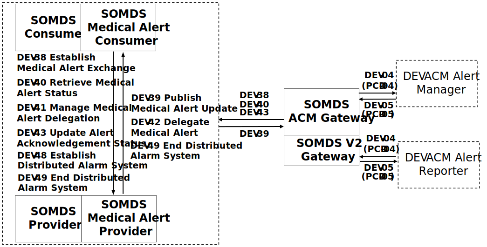

// = Service-oriented Device Point-of-care Interoperability - Alerting (SDPi-A) Profile

[#vol1_clause_sdpi_a_profile,sdpi_offset=12]
== Service-oriented Device Point-of-care Interoperability - Alerting (SDPi-A) Profile

[%noheader]
[%autowidth]
[cols="1"]
|===
a| *SDPi Supplement Version 1.0 Note*:  This initial version of the <<acronym_sdpi_a>> Profile is built upon the foundational <<acronym_sdpi_p>> Profile but adds services specialized for the communication and management of medical device alerting.
Additionally, since the primary purpose of this specification is the communication of medical alert information to accomplish intended medical purposes, it will require the completion and integration of the emerging ISO/IEEE 11073 Alert <<acronym_pkp>> standard  <<ref_ieee_11073_10702_202x>>.
When this new standard is published *_in late 2023 or early 2024_*, its requirements will be integrated into this supplement, with its <<term_implementation_conformance_statement>> added to <<vol1_appendix_b_referenced_standards_conformance>>.
Many of those requirements will be mapped to the actors, transactions and other specifications in this specification.

Two of the transactions identified below, DEV-41 and DEV-42 are related to Medical Alert Delegation; however, at this stage there is considerable standards development activity to update the current <<acronym_sdc>> standards, particularly in association with completing the Alert <<acronym_pkp>> standard  <<ref_ieee_11073_10702_202x>>.
As a result, the completion of these two transactions has been deferred to a subsequent version of the supplement.

Similarly, a related transaction, DEV-43, namely providing clinician alert acknowledgement status information back to the alerting device, is also being discussed further and will be deferred to a subsequent version of the supplement.

Finally, it should be noted that  <<actor_somds_acm_gateway>> is defined below and fully specified in <<vol2_clause_appendix_sdpi_acm_gateway>>.
Also in development is <<acronym_hl7>> <<acronym_fhir>> support for medical alerting (e.g., definition of a <<acronym_fhir>> DeviceAlert resource); however, that will not be completed until 2024 or beyond.
As a result, a "SOMDS Medical Alert FHIR Gateway" is not included as an actor at this stage; however, it is expected to be added in the coming year or two.

|===

[#vol1_clause_sdpi_a_profile_reftext,reftext="SDPi-A Profile"]
The SDPi-Alerting ([[acronym_sdpi_a,SDPi-A]] SDPi-A) Profile supports the communication of alert information from one <<term_service_oriented_medical_device_system>> to other <<acronym_somds>> systems or to other external non-<<acronym_somds>> systems utilizing a <<label_system_type_name_agw>>.
The actors and transactions in this specification are specialized versions of their counterparts in the <<vol1_clause_sdpi_p_profile_reftext>>; however, are differentiated in that they are specifically designed to communicate alert information to fulfill an _intended medical purpose_, primarily to notify a clinician of a patient or device-related condition that requires their attention.
Additional services have been provided to specifically support the exchange and management of this medical device alert information, providing a high-level of reliability and performance, commensurate with the potential risk to the patient if they are not promptly addressed.

The profile builds upon the foundational <<term_plug_and_trust>> capabilities provided by the <<vol1_clause_sdpi_p_profile_reftext>>.
These extended capabilities for medical data exchange are achieved by various means, including:

. Grouping <<acronym_sdpi_r>> actors with their <<acronym_sdpi_p>> counterparts
. Addressing requirements from the emerging <<acronym_pkp>> ISO/IEEE standards:  <<ref_ieee_11073_10700_2022>> and <<ref_ieee_11073_10701_2022>>
. Requiring capabilities that in the <<vol1_clause_sdpi_p_profile_reftext>> may be optional
. Requiring additional <<acronym_biceps>> data elements or content modules

Additional requirements to addressed safety and effectiveness requirements are provided in <<vol1_clause_sdpi_a_ses_considerations>>.

[#vol1_clause_sdpi_a_actors_transactions_content_modules]
=== SDPi-A Actors, Transactions, and Content Modules

This section defines the actors, transactions, and/or content modules in this specification.
General definitions of actors are given in the https://profiles.ihe.net/GeneralIntro/ch-A.html[_Technical Frameworks General Introduction Appendix A_].
IHE Transactions can be found in the https://profiles.ihe.net/GeneralIntro/ch-B.html[_Technical Frameworks General Introduction Appendix B_].
Both appendices are located at https://profiles.ihe.net/GeneralIntro/[_profiles.ihe.net/GeneralIntro_].

<<vol1_figure_sdpi_a_actor_diagram>> shows the actors directly involved in the SDPi-A Profile.
The relevant transactions between them are detailed in the subsequent <<vol1_table_sdpi_a_actors_transactions>>.
Actor groupings, including abstract with concrete are detailed in <<vol1_clause_sdpi_a_required_actor_groupings>>.

[#vol1_figure_sdpi_a_actor_diagram]
.SDPi-A Actor Diagram

{empty} +

////

#TODO:  In the table below, are any of these Receiver vs. Responder?  If so, then we may need to add a note like in SDPi-P

#TODO: Do we need to add an option note for Alert Delegation?#

////

[#vol1_table_sdpi_a_actors_transactions]
.SDPi-A Profile - Actors and Transactions
[%autowidth]
[cols="1,2,1,1,3"]
|===
.^|Actors
.^|Transactions
.^|Initiator or Responder
.^|Optionality
.^|Reference

.6+| <<vol1_spec_sdpi_a_actor_somds_medical_alert_provider>>
.^| <<transaction_name_establish_medical_alert_exchange>>
.^| Initiator
.^| R
| <<vol2_clause_dev_38>>

| <<transaction_name_publish_medical_alert_update>>
| Responder
| R
| <<vol2_clause_dev_39>>

| <<transaction_name_retrieve_medical_alert_status>>
| Initiator
| R
| <<vol2_clause_dev_40>>

| <<transaction_name_manage_medical_alert_delegation>> (_deferred_)
| Responder
| R
| DEV-41 Deferred to SDPi 2.0
// <<vol2_clause_dev_41>>

| <<transaction_name_delegate_medical_alert>> (_deferred_)
| Initiator
| R
| DEV-42 Deferred to SDPi 2.0
// <<vol2_clause_dev_42>>

| <<transaction_name_update_alert_acknowledgement_status>> (_deferred_)
| Initiator
| R
| DEV-43 Deferred to SDPi 2.0
// <<vol2_clause_dev_43>>

.6+| <<vol1_spec_sdpi_a_actor_somds_medical_alert_consumer>>
.^| <<transaction_name_establish_medical_alert_exchange>>
.^| Responder
.^| R
| <<vol2_clause_dev_38>>

| <<transaction_name_publish_medical_alert_update>>
| Initiator
| R
| <<vol2_clause_dev_39>>

| <<transaction_name_retrieve_medical_alert_status>>
| Responder
| O
| <<vol2_clause_dev_40>>

| <<transaction_name_manage_medical_alert_delegation>> (_deferred_)
| Responder
| R
| DEV-41 Deferred to SDPi 2.0
// <<vol2_clause_dev_41>>

| <<transaction_name_delegate_medical_alert>> (_deferred_)
| Initiator
| R
| DEV-42 Deferred to SDPi 2.0
// <<vol2_clause_dev_42>>

| <<transaction_name_update_alert_acknowledgement_status>> (_deferred_)
| Initiator
| R
| DEV-43 Deferred to SDPi 2.0
// <<vol2_clause_dev_43>>

.4+| <<vol1_spec_sdpi_a_actor_somds_acm_gateway>>
.^| <<transaction_name_establish_medical_alert_exchange>>
.^| Initiator
.^| R
| <<vol2_clause_dev_38>>

| <<transaction_name_publish_medical_alert_update>>
| Responder
| R
| <<vol2_clause_dev_39>>

| <<transaction_name_retrieve_medical_alert_status>>
| Initiator
| O
| <<vol2_clause_dev_40>>

| <<transaction_name_update_alert_acknowledgement_status>> (_deferred_)
| Initiator
| O
| dev-43 Deferred to SDPi 2.0
// <<vol2_clause_dev_43>>

5+<|
Note 1: If the <<vol1_spec_sdpi_a_actor_somds_acm_gateway>> supports  <<vol1_clause_sdpi_a_actor_option_remote_alert_signaling>>, then bidirectional exchange is supported and the roles are expanded to "Initiator & Responder".

|===

[#vol1_clause_sdpi_a_actor_descriptions_actor_profile_requirements]
==== Actor Descriptions and Actor Profile Requirements

[#vol1_clause_sdpi_a_somds_medical_alert_consumer]
===== SOMDS Medical Alert Consumer
[#vol1_spec_sdpi_a_actor_somds_medical_alert_consumer, reftext='SOMDS Medical Alert Consumer']
Actor Summary Definition:
[none]
. A <<vol1_spec_sdpi_p_actor_somds_consumer>> grouped actor that receives medical alert information from a <<vol1_spec_sdpi_a_actor_somds_medical_alert_provider>>.

This actor is designed to receive and manage medical device alert information to communicate it safely and reliably to a clinician.
Transactions enabled for this actor are identified in <<vol1_table_sdpi_a_actors_transactions>> above.

Given this _intended medical purpose_, the actor will fully address applicable requirements from the core <<acronym_sdc>> standards (<<ref_ieee_11073_10207_2017>> and <<ref_ieee_11073_20701_2018>>), as well as the <<acronym_pkp>> standards <<ref_ieee_11073_10700_2022>> and <<ref_ieee_11073_10702_202x>> (Alert <<acronym_pkp>>).

Every <<vol1_spec_sdpi_a_actor_somds_medical_alert_consumer>> is grouped with an <<vol1_spec_sdpi_p_actor_somds_consumer>> to enable <<acronym_somds>>-based connectivity.
This actor inherits all the capabilities of the paired <<vol1_spec_sdpi_p_actor_somds_consumer>>.
Note that optional capabilities for this specification, as specified in <<vol1_clause_sdpi_a_actor_options>>, may also result in additional requirements for the underlying <<vol1_spec_sdpi_p_actor_somds_consumer>> and <<vol1_clause_sdpi_p_profile_reftext>>.

Note that if a <<label_system_type_name_sas>> is being created, it may incorporate both <<vol1_spec_sdpi_a_actor_somds_medical_alert_consumer>> and <<vol1_spec_sdpi_a_actor_somds_medical_alert_provider>> Actors, both receiving and publishing alerts.

[#vol1_clause_sdpi_a_somds_medical_alert_provider]
===== SOMDS Medical Alert Provider
[#vol1_spec_sdpi_a_actor_somds_medical_alert_provider, reftext='SOMDS Medical Alert Provider']
Actor Summary Definition:
[none]
. A <<vol1_spec_sdpi_p_actor_somds_provider>> grouped actor that sends medical alert information to a <<actor_somds_medical_alert_consumer>>.

This actor is designed to publish medical device alert information to a <<vol1_spec_sdpi_a_actor_somds_medical_alert_consumer>>, which in turn can communicate it safely and reliably to a clinician.
Transactions enabled for this actor are identified in <<vol1_table_sdpi_a_actors_transactions>> above.

Given this _intended medical purpose_, the actor will fully address applicable requirements from the core <<acronym_sdc>> standards (<<ref_ieee_11073_10207_2017>> and <<ref_ieee_11073_20701_2018>>), as well as the <<acronym_pkp>> standards <<ref_ieee_11073_10700_2022>> and <<ref_ieee_11073_10702_202x>> (Alert <<acronym_pkp>>).

Every <<vol1_spec_sdpi_a_actor_somds_medical_alert_provider>> is grouped with an <<vol1_spec_sdpi_p_actor_somds_provider>> to enable <<acronym_somds>>-based connectivity.
This actor inherits all the capabilities of the paired <<vol1_spec_sdpi_p_actor_somds_consumer>>.
Note that optional capabilities for this specification, as specified in <<vol1_clause_sdpi_a_actor_options>>, may also result in additional requirements for the underlying <<vol1_spec_sdpi_p_actor_somds_consumer>> and <<vol1_clause_sdpi_p_profile_reftext>>.

Note that if a <<label_system_type_name_sas>> is being created, it may incorporate both <<vol1_spec_sdpi_a_actor_somds_medical_alert_consumer>> and <<vol1_spec_sdpi_a_actor_somds_medical_alert_provider>> Actors, both receiving and publishing alerts.

[#vol1_clause_sdpi_a_somds_acm_gateway]
===== SOMDS ACM Gateway
[#vol1_spec_sdpi_a_actor_somds_acm_gateway, reftext='SOMDS ACM Gateway']
Actor Summary Definition:
[none]
. A <<vol1_spec_sdpi_p_actor_somds_v2_gateway>> grouped actor that supports the bi-directional exchange of medical alert information with non-SOMDS systems and applications using IHE Alert Communication Management (ACM) transactions.

This a is designed to exchange medical device alert information to external non-<<acronym_somds>> systems using the <<acronym_hl7>> V2-based Alert Communication Management (ACM) profile transactions.

Every <<vol1_spec_sdpi_a_actor_somds_acm_gateway>> is grouped with an <<vol1_spec_sdpi_p_actor_somds_v2_gateway>> to enable <<acronym_somds>>-based connectivity.
This actor inherits all the capabilities of the paired <<vol1_spec_sdpi_p_actor_somds_v2_gateway>>.
Note that optional capabilities for this specification, as specified in <<vol1_clause_sdpi_r_actor_options>>, may also result in additional requirements for the underlying <<vol1_spec_sdpi_p_actor_somds_v2_gateway>> and <<vol1_clause_sdpi_p_profile_reftext>>.

Transactions enabled for this actor are identified in <<vol1_table_sdpi_a_actors_transactions>> above.

Given this _intended medical purpose_, the actor will fully address applicable requirements from the core <<acronym_sdc>> standards (<<ref_ieee_11073_10207_2017>> and <<ref_ieee_11073_20701_2018>>), as well as the <<acronym_pkp>> standards <<ref_ieee_11073_10700_2022>> and <<ref_ieee_11073_10702_202x>> (Alert <<acronym_pkp>>).

This actor shall implement the <<vol1_spec_sdpi_a_actor_somds_medical_alert_consumer>> capabilities, receiving alert information provided by <<vol1_spec_sdpi_a_actor_somds_medical_alert_provider>> systems and publishing them as DEV-04 / PCD-04 Transactions to external ACM Alert Manager (AM) systems.
If <<vol1_clause_sdpi_a_actor_option_remote_alert_signaling_reftext>> is implemented, then this actor will also support the <<vol1_spec_sdpi_a_actor_somds_medical_alert_provider>> capabilities, receiving DEV-04 / PCD-04 Transactions from external ACM Device Observation Reporter (DOR) systems and making them available to other <<vol1_spec_sdpi_r_actor_somds_medical_data_consumer>> systems.
Note:  Not supported are <<vol1_spec_sdpi_r_actor_somds_dec_gateway>> systems that only implement the <<vol1_spec_sdpi_r_actor_somds_medical_data_provider>> and not <<vol1_spec_sdpi_r_actor_somds_medical_data_consumer>> capabilities.

Detailed specifications for mapping from <<acronym_somds>>/<<acronym_biceps>>  to <<acronym_hl7>> V2 / ACM DEV-04/PCD-04 transactions are provided in <<vol2_clause_appendix_sdpi_acm_gateway>>.

NOTE: This actor is not intended to play the role of an ACM Alert Manager.
If DEV-04 transactions are received by the gateway, they will be simply mapped to <<acronym_somds>>/<<acronym_biceps>> semantics and provided to <<vol1_spec_sdpi_a_actor_somds_medical_alert_consumer>> systems.

If a <<label_system_type_name_sas>> is being created, it may incorporate both <<vol1_spec_sdpi_a_actor_somds_medical_alert_consumer>> and <<vol1_spec_sdpi_a_actor_somds_medical_alert_provider>> Actors, both receiving and publishing alerts to external ACM-based systems.

[#vol1_clause_sdpi_a_actor_options]
=== SDPi-A Actor Options

[#vol1_clause_sdpi_a_actor_option_alert_delegation]
==== Alert Delegation Option

[#vol1_clause_sdpi_a_actor_option_alert_delegation_reftext, reftext='SDPi-A Option:  Alert Delegation']
[%noheader]
[%autowidth]
[cols="1"]
|===
a| *SDPi Supplement Version Note*:  This section is left intentionally blank to indicate capabilities that will be added in a future version of the SDPi Supplement.

This option will enable <<vol1_spec_sdpi_a_actor_somds_medical_alert_provider>> systems to safely and reliably transfer or "delegate" audible annunciation of alert conditions to another system.
This option will enable both the DEV-41 <<transaction_name_manage_medical_alert_delegation>> and DEV-42 <<transaction_name_delegate_medical_alert>> transactions.

|===

[#vol1_clause_sdpi_a_actor_option_alert_user_acknowledgement]
==== Alert User Acknowledgement Option

[#vol1_clause_sdpi_a_actor_option_alert_user_acknowledgement_reftext, reftext='SDPi-A Option:  Alert User Acknowledgement']
[%noheader]
[%autowidth]
[cols="1"]
|===
a| *SDPi Supplement Version Note*:  This section is left intentionally blank to indicate capabilities that will be added in a future version of the SDPi Supplement.

This option will enable <<vol1_spec_sdpi_a_actor_somds_medical_alert_provider>> systems to safely and reliably receive from <<vol1_spec_sdpi_a_actor_somds_medical_alert_consumer>> systems user (clinician) acknowledgement of previously reported alert conditions.
This option will enable the DEV-43 <<transaction_name_update_alert_acknowledgement_status>> transaction.

|===

[#vol1_clause_sdpi_a_actor_option_remote_alert_signaling]
==== Remote Alert Signaling

[#vol1_clause_sdpi_a_actor_option_remote_alert_signaling_reftext, reftext='SDPi-A Option:  Remote Alert Signaling']
[%noheader]
[%autowidth]
[cols="1"]
|===
a| *SDPi Supplement Version Note*:  This section is left intentionally blank to indicate capabilities that will be added in a future version of the SDPi Supplement.

This option will enable <<vol1_spec_sdpi_a_actor_somds_acm_gateway>> systems to receive DEV-04/PCD-04 transactions from an ACM Alert Manager and then act as a <<vol1_spec_sdpi_a_actor_somds_medical_alert_provider>> to communicate the signals to <<vol1_spec_sdpi_a_actor_somds_medical_alert_consumer>> systems
This option will enable the <<vol1_spec_sdpi_a_actor_somds_acm_gateway>> to respond to DEV-38 <<transaction_name_establish_medical_alert_exchange>> and DEV-40 <<transaction_name_retrieve_medical_alert_status>> transactions, and to initiate DEV-39 <<transaction_name_publish_medical_alert_update>> transactions.

|===

[#vol1_clause_sdpi_a_required_actor_groupings]
=== SDPi-A Required Actor Groupings

[%noheader]
[%autowidth]
[cols="1"]
|===
a| *SDPi Supplement Version Note*:  As indicated in <<vol1_figure_sdpi_r_actor_diagram>> above, there are four grouped actors:

[none]
. <<vol1_spec_sdpi_a_actor_somds_medical_alert_consumer>> with <<vol1_spec_sdpi_p_actor_somds_consumer>>
. <<vol1_spec_sdpi_a_actor_somds_medical_alert_provider>> with <<vol1_spec_sdpi_p_actor_somds_provider>>
. <<vol1_spec_sdpi_a_actor_somds_acm_gateway>> with <<vol1_spec_sdpi_p_actor_somds_v2_gateway>>

This section will be more completely detailed in a future version of the supplement.

|===

// 12.4
=== SDPi-A Overview

// 12.4.1
==== Concepts

[%noheader]
[%autowidth]
[cols="1"]
|===
a| *SDPi Supplement Version Note*:  An overview of the concepts for this <<vol1_clause_sdpi_a_profile_reftext>> will be provided in a future supplement version.
Note that this specification extends the concepts established in the base <<vol1_clause_sdpi_p_profile_reftext>>.
|===

[#vol1_clause_sdpi_a_use_cases_reftext, reftext='SDPi-A Use Cases']
==== Use Cases
The SDPi-A profile supports requirements from use cases detailed in <<vol1_appendix_c_dpi_use_cases>>.  The following subsections identify the specific use case requirements that are fulfilled with capabilities provided by this specification.

===== <<label_use_case_name_sicdsp>> (<<acronym_sicdsp>>)
This use case provides capabilities for requirements from <<vol1_clause_appendix_c_use_case_sicdsp>>.

Specific capabilities supporting the <<acronym_sicdsp>> use case include:

* *System Type*:  N/A
* *Service Type*:  N/A
* *Technical Pre-Conditions*: N/A
* *Scenarios*: <<acronym_sicdsp>> <<vol1_clause_appendix_c_use_case_sicdsp_scenarios>> communication of medical alert information to a <<vol1_spec_sdpi_p_actor_somds_consumer>> <<system_type_dashboard>>

===== <<label_use_case_name_sicdmp>> (<<acronym_sicdmp>>)
This use case provides capabilities for requirements from <<vol1_clause_appendix_c_use_case_sicdmp>>.

Specific capabilities supporting the <<acronym_sicdmp>> use case include:

* *System Type*:  N/A
* *System Type*:  N/A
* *Technical Pre-Conditions*: N/A
* *Scenarios*: <<acronym_sicdmp>> <<vol1_clause_appendix_c_use_case_sicdmp_scenarios>> communication of medical alert information to a <<vol1_spec_sdpi_p_actor_somds_consumer>> <<system_type_dashboard>>

===== <<label_use_case_name_acns>> (<<acronym_acns>>)
This use case provides capabilities for requirements from <<vol1_clause_appendix_c_use_case_acns>>.

Specific capabilities supporting the <<acronym_acns>> use case include:

* *System Type*:  N/A
* *Service Type*:  N/A
* *Technical Pre-Conditions*:  N/A
* *Scenarios*:  <<acronym_acns>> <<vol1_clause_appendix_c_use_case_acns_scenarios>> communication of medical alert information to a <<vol1_spec_sdpi_p_actor_somds_consumer>> Alert <<system_type_device_gateway>>

===== <<label_use_case_name_aars>> (<<acronym_aars>>)
This use case provides capabilities for requirements from <<vol1_clause_appendix_c_use_case_aars>>.

Specific capabilities supporting the <<acronym_aars>> use case include:

* *System Type*:  N/A
* *Service Type*:  N/A
* *Technical Pre-Conditions*:  N/A
* *Scenarios*:  <<acronym_aars>> <<vol1_clause_appendix_c_use_case_aars_scenarios>> communication of medical alert information to a <<vol1_spec_sdpi_p_actor_somds_consumer>> Alert <<system_type_device_gateway>>

[#vol1_clause_sdpi_a_ses_considerations]
=== SDPi-A Safety, Effectiveness, Security Considerations and Requirements

==== SES General Considerations
Requirements from the <<ref_iso_81001_1_2021>>, <<ref_iec_80001_1_2021>>, and related standards should be fully applied to this technical framework element.

For additional guidance, see section <<vol1_clause_appendix_a_ses_considerations_and_requirements>>.

==== Safety Requirements & Considerations
No additional safety requirements or considerations are identified for this technical framework element beyond those specified in the _<<acronym_ses>> General Considerations_ section above.

==== Effectiveness Requirements & Considerations
No additional effectiveness requirements or considerations are identified for this technical framework element beyond those specified in the _<<acronym_ses>> General Considerations_ section above.

==== Security Requirements & Considerations
No additional security requirements and considerations are identified for this technical framework element beyond those provided by the  SDPi-P profile (see <<vol1_clause_appendix_a_ses_considerations_section_template>>), and those specified in the _<<acronym_ses>> General Considerations_ section above.

// 12.6
=== SDPi-A Cross Profile Considerations
No additional cross profile considerations have been identified.

////
#TODO:  See the template instructions + PCD 2019 and other TF's to see if any content should go in this section for SDPi-A.#
////

