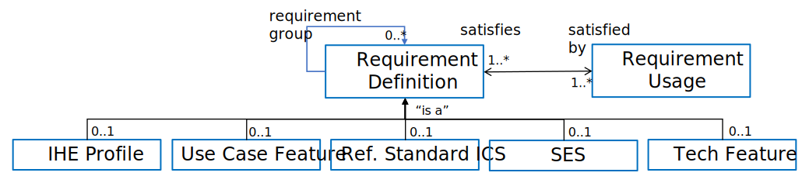

// = Requirements Management for Plug-and-Trust Interoperability

// Appendix A
[appendix#vol1_appendix_a_requirements_management_for_p_n_t_interperability,sdpi_offset=A]
== Requirements Management for Plug-and-Trust Interoperability

These SDPi specifications include the model-centric integration of requirements from multiple sources -- both within IHE and from other <<acronym_sdo>>s -- enabling a new level of *requirements management* that provides new value to all stakeholders.  Also termed *_<<term_requirements_interoperability>>_*, innovative capabilties include:

. Explicit linking of requirements from their definition to their satisfaction / utilization in defined _capabilities_;
. Explicit linking of requirements from external sources (e.g., normative standards references) to where they are supported in the profile specification, either completely, partially, unsupported or out-of-scope;
. Requirement "chains" -- sequences of requirement-capability links, including requirement-to-requirement and capability-to-capability -- that enable traceability from capability conformance testing to the multiple requirements that the function satisfies ;
. Referenced standard _traceability_ and _coverage_ is enabled by this linkage from each requirement to testable interface capabilities;
. Both <<acronym_ses>> and <<acronym_mdi>> standards are supported, enabling true <<acronym_ses_mdi>> integration;
. Test reports and declarations of conformity can be created to support the needs of and increase the confidence of all stakeholders, from technology product developers, to public regulatory agencies, to system integrators, to healthcare delivery organizations that manage and use the systems, to patients who will directly benefit from improved healthcare and health!

These combine to establish <<acronym_ri>> as the door to a new generation of truly "computable" specifications.

From another perspective, _requirements interoperability_ looks at one standard as having both a set of requirements that must be satisfied for a system to be conformant, and a set of capabilities that it provides that can be utilized to meet the requirements of other standards.  Requirements interoperability essentially looks at each standard as a set of building blocks that can be snapped together and integrated into a coherent and cohesive structure.

The following sections in this appendix provide background on the concepts and rationale behind requirements interoperability and the details for how it is implemented in this specification.

// A.1
[#vol1_clause_appendix_a_requirements_from_narratives_to_pnt_interfaces,sdpi_offset=1]
=== Requirements:  From Narratives to Plug-and-Trust Interfaces

For every device or system interface that supports the elements specified in this technical framework, requirements and capabilities are derived from many different standards, types of standards, and standards development organizations (SDO).
Some are technology focused, such as the ISO/IEEE 11073 standards for health device communication, and others are more focused on quality and risk management, such as the ISO/IEC 80001-1 and ISO 14971 standards.
They are all profiled and implemented and tested in a single interface point, and thus need to be integrated in a coherent and cohesive manner.

In order to manage this diversity and wealth of specifications and standards, the Hanging Gardens Framework graphic as specified in <<hanging_gardens_framework>> was created:

.Hanging Gardens Framework
[#hanging_gardens_framework]
image::../images/vol1-diagram-hanging-gardens.svg[]

Though a full explanation of the this framework is beyond this discussion footnote:hanging_gardens_framework_article[A more detailed explanation of this model is provided on the https://confluence.hl7.org/x/4ijxB[IHE-HL7 Gemini _Hanging Gardens Framework_ confluence page].
Last accessed 2022.10.04.], some general observations will help understand the value and use of the framework:

. Real-world Requirements are at the top -- use case requirements, detailing clinical system functions ensure that all requirements and capabilities are rooted in the purposes that technology users are advancing, namely to provide safe;
. Each layer or "garden" and contained specification(s) define - implicitly or explicitly - how they integrate with other layers:  _*capabilities*_ that are provided (to meet the needs of other layers), and _*requirements*_ (needed capabilities) for other layers and implementations;
. Standards are sometimes grouped into families (e.g., ISO/IEEE 11073 SDC) - this indicates that they are internally cohesive as well as able to be integrated as a group with other areas;
. _*Vertical*_ groupings on the left indicate standards that apply to all of the _*horizontal*_ layers in the core of the model;
. Profile standards, such as the SDPi+FHIR, generally integrate specifications through the layers from the top to the bottom similar, with each layer contributing to those below and converging in a single interface capability bundle;
. Physical layers are leveraged, not re-invented, which is why there is no color in the bottom layer;
. _*Requirements interoperability*_ is achieved by tracing "profile lines" from top to bottom, integrating requirements from one layer's specification to the capabilities provided by another layer;
. Requirement TYPEs are rooted in the layers that they represent and link type definitions to their use in this specification; see <<vol1_clause_sdpi_requirements_core_model>> Section below.>.

NOTE:  The implementation of this high-level framework will be extended as the specifications and tooling mature.

// A.2
[#vol1_appendix_a_integrating_ses]
=== Integrating Safety, Effectiveness and Security Requirements and Considerations

In 2007, a joint effort between ISO/TC 215 and IEC/SC 62A was launched -- Joint Working Group 7 (JWG7) -- to focus on how to apply risk management to medical devices and health information systems and software that needed to interoperate on shared (hospital owned & managed) networking infrastructure.
The resulting standard, <<ref_iec_80001_1_2021>>, with a first edition published in 2010 and revised in 2021, not only provided a process for performing coordinated multi-stakeholder risk management for these technologies, but recognized the three *key properties* that would be the focus of that risk management:  *_Safety, Effectiveness & Security (SES)_* footnote:ses_definitions[For definitions of these and other related terms, consult the https://81001.org[NHS 81001.org web page.] Last accessed 2022.10.04.].

During the development of the 80001-1 standard, though, it was recognized that risk management is just one of a number of other core themes that had to be managed in concert (e.g., quality management, human factors / usability).
Also ensuring SES required processes that involve a total product lifecycle, with responsibilities transitioning across that period.  To address these requirements, JWG7 developed the <<ref_iso_81001_1_2021>> standard, which also included The Temple diagram to communicate various aspects of SES that must be considered and managed:

.ISO/IEC 81001-1 -- The "Temple" Diagram

image::../images/vol1-diagram-81001-temple.svg[algin=center]
[none]
. Source:  <<ref_iso_81001_temple>>

One of the key challenges for implementing this standard, though, is what might be labeled:  *_The Interoperability Trust Gap_*.
This is the technology "hand off" space between the left side of the lifecycle -- Design and development phase, where key responsibility is by each of the "Accountable Manufacturer" organizations, and the right side of the lifecycle -- Implementation phase & Clinical use phase, where key responsibility is on the Accountable Healthcare Delivery Organization (HDO).
Though this reads well in the standards and the model organizes everything in a clear fashion, operationalizing this in real world use remains a Sisyphean effort, primarily due to the amount of expertise, time and resources needed to effectively implement the SES standards as part of normal operating business in HDOs.

To address this <<acronym_ses>> implementation problem, the SDPi Profiles:

. Leverage the ISO/IEEE 11073-1070x <<term_participant_key_purposes>> standards, which represent a consensus standard for risk management of technologies that are implemented in that left-right gap on the Temple model;
. <<term_implementation_conformance_statement>> tables from each of these <<acronym_pkp>> standards is included in <<vol1_appendix_b_references>> of this specification, with indication as to whether, how and where each requirement is addressed;
. "Safety, Effectiveness and Security - Requirements and Considerations" sections are integrated throughout the profile specifications to link from the <<acronym_pkp>> <<acronym_ics>> table requirements to the satisfying capabilities.
[none]
.. Additional non-PKP risk management will also be performed by subject matter experts and formalized in these <<acronym_ses>> Considerations sections, where appropriate.

These "Safety, Effectiveness and Security - Requirements and Considerations" sections grew out of the _IHE "Security Considerations"_ sections + the IHE Devices _"Safety Considerations"_ sections, but are now consolidated into a single SES section that integrates the 3rd risk management property, Effectiveness.
Whenever possible, each of these considerations should be associated with the requirements of specific standards (e.g, <<ref_ieee_11073_10700_2022>>).

NOTE:  The moniker *_<<acronym_ses_mdi>>_* is shorthand to refer to the integration of the technical medical device interoperability (MDI) specifications  with the application of quality / risk management SES standards and processes.

How does this address the "interoperability trust gap"?  By integrating SES directly into the specifications, especially integrating the ISO/IEC 11073-1070x standards, enabling "plug-and-trust" system product components, the SES implementation and operational requirements and responsibilities are greatly reduced, the "gap" is filled for all stakeholders, and the goals of improved safety, security and clinical effectiveness of technology can be readily realized.

[#vol1_clause_appendix_a_ses_considerations_section_template]
=== SES Considerations Section Template

Given the forgoing discussion in <<vol1_clause_ses_considerations_requirements>>, a standardized template is defined for addressing <<acronym_ses>> requirements as appropriate, including within the scope of profiles, actors, transactions, and content modules.
The content in the following sections should be included and then specialized as appropriate for the associated technical framework element.

////
#TODO:  Should we and where should we add references to the IHE DEV MEM security white papers + and the ITI security cookbook etc.?#

#TODO:  Should "mixed safety class" discussions / issue be mentioned in the template or in this section?  Note:  it is mentioned in the TF-3 BICEPS section.#
////

[%noheader]
[%autowidth]
[cols="1"]
|===
a| *SES Section Template*:

[#vol1_clause_appendix_a_ses_considerations_and_requirements]
=== Safety, Effectiveness and Security - Requirements and Considerations

==== SES General Considerations
NOTE: This section includes guidance and requirements that are not further specialized for specific <<acronym_ses>> properties.

Requirements from the <<ref_iso_81001_1_2021>>, <<ref_iec_80001_1_2021>>, and related standards should be fully applied to this technical framework element.

For additional guidance, see Section <<vol1_clause_appendix_a_ses_considerations_and_requirements>>.

==== Safety Requirements & Considerations
NOTE: This section includes guidance and requirements that are focused on unique *_Safety_* requirements associated with associated technical framework element.  Note: a simple definition of safety within the context of risk management is "freedom from unacceptable harm" (see https://81001.org/concept/safety[81001.org/safety])

No additional safety requirements or considerations are identified for this technical framework element beyond those specified in the _<<acronym_ses>> General Considerations_ Section above.

==== Effectiveness Requirements & Considerations
NOTE: This section includes guidance and requirements that are focused on unique *_Effectiveness_* requirements associated with associated technical framework element.  Note:  in the context of risk management key properties, effectiveness is the ability to perform the intended use (see https://81001.org/concept/effectiveness[81001.org/effectiveness])

No additional effectiveness requirements or considerations are identified for this technical framework element beyond those specified in the _<<acronym_ses>> General Considerations_ Section above.

==== Security Requirements & Considerations
NOTE: This section includes guidance and requirements that are focused on unique *_Security_* requirements associated with associated technical framework element.
In the context of risk management key properties, security is a state where information and systems are protected from unauthorized activities to a degree that the related risks to confidentiality, integrity, and availability are maintained at an acceptable level throughout the lifecycle (see https://81001.org/concept/security[81001.org/security])

No additional security requirements and considerations are identified for this technical framework element beyond those provided by the  SDPi-P profile, and those specified in the _<<acronym_ses>> General Considerations_ Section above.

|===

[#vol1_clause_sdpi_requirements_modeling_integration]
=== SDPi Requirements Modeling & Integration

As pointed out above, requirements interoperability (RI) based on robust model-based metadata is a core, innovative aspect of this SDPi Profiles specification.
Given the ultimate intent to realize this description as a _Model Centric (MC) single-source-of-truth, computable, simulatable, verifiable and validatable system of systems interoperability specification_, and recognizing that it will take a significant transition period from a document-centric approach to a model-centric approach, a simplified requirements model is provided below but is aligned with the <<ref_omg_sysml_2_0_spec>> Section 7.20 Requirements language.
Of course, that specification provides for significantly more detailed and complex modeling, the general constructs may be used in this document to start the transition toward that model.
Note that SysML 2.0 also better supports model interoperability (tool-independent model exchange) and _<<term_model_based_systems_engineering>>_ (see https://en.wikipedia.org/wiki/Model-based_systems_engineering[MBSE Wikipedia article and references]), as well as the <<ref_ihe_eu_experience_2021_presentation_cooper_schlichting>> for an overview presentation of MBSE, MedTech system V&V, and IHE Conformity Assessment.

It should be further noted that though conformity testing aspects are beyond this revision of the SDPi specification, the modeling constructs used below will also be integrated with <<ref_omg_sysml_2_0_spec>> Section 7.23 Verification Cases, to provide for advanced V&V of interoperable system components and entire systems of products.

[#vol1_clause_sdpi_requirements_core_model]
==== SDPi Requirements Core Model

To formally integrate requirements in to this specification, the following model details the core types of requirements that will be defined:

[#vol1_figure_appendix_a_sdpi_requirements_core_model]
.SDPi Requirement Categories - Core Model

This model identifies the set of requirement "types" that are utilized in the specification.

Each type defines a unique class of requirements that build upon a foundational specification that may be specialized with additional metata to better capture the unique source and role of each specification.

[%autowidth]
[cols="^1,4,^1,^1"]
|===
|Model Element |Description |AsciiDoc Attribute |Further Specified

| SDPi Requirement
| A defined stakeholder-imposed constraint that must be satisfied for a design solution to be valid.  This is an \{abstract} class model element.
| sdpi_requirement
| See subtypes

| SDPi Requirement Group
| Two or more SDPi Requirements may be collected into a group that is focused around a specific _subject_ area.
| sdpi_requirement_group
|

| Requirement Usage
| Requirement utilized in a specific use context that provides for its satisfaction.
| sdpi_requirement_usage
|

| IHE Profile
| Each IHE profile specification has a set of requirements that must be captured.  For example, Actor X in Profile Y requires support for Transaction A + B + C.  NOTE:  These requirements provide the anchor for all conformity assessment, since implementations will identify the actors + profile + profile option + role + transactions that they support.  See also "AIPO" discussion below.
| sdpi_requirement_ihe_profile
|

| Use Case Feature
| A functional "feature" requirement based on clinical use case scenarios.
| sdpi_requirement_use_case
| See TF-1 Appendix C, gherkin model

| Ref. Standard ICS
| Requirement definitions that are specified in a normative reference.
| sdpi_requirement_ref_standard
|

| SES
| Non-technical requirements related to Safety, Effectiveness, and Security are captured in these blocks.  These are especially relevant to mapping ISO/IEEE 11073-1070x Participant Key Purposes standard requirements to elements within the SDPi specification.
| sdpi_requirement_ses
| See SES Section <<vol1_appendix_a_integrating_ses>>

| Tech Feature
| Technology focused requirements result from the use of a particular implementation approach.  For example, use of TLS 1.3 may also result in the need to address related technical capabilities.
| sdpi_requirement_tech_feature
|
|===

////
#TODO: show core data elements for this abstract SDPi Requirement Definition #

#TODO: note navigating relationships from usage to requirements supports traceability from capabilities / feature verification back to source requirements and group coverage#

#TODO:  Mention traceability & coverage#

////

The following subsections provide additional detail for each element of the above requirements model.  Note that each item includes metadata that is used for computability purposes as well as textual elements that are visibly rendered in the document.  All content may be exported from the specification and contained in a requirements summary specification in a common format (e.g., JSON), and that may be used for purposes such as integration into requirements management tools and conformity assessment tooling.

==== Requirement Definition

Each type of requirement shares a common set of metadata represented by the abstract "Requirement Definition" in the model above.  This metadata supports the basic capabilities of each requirement including classification (subtype), navigation (traceability), and grouping.

===== Unique Identifier Labeling

#TODO: Requirements (incl. beyond SDPi) for unique requirement identifiers#

#TODO: Rubric for labeling / numbering requirements#

sdpi_requirement#r1234

===== Usage Levels

sdpi_req_level=shall/should/may

===== Requirement Grouping
#TODO: Requirement for subtyping & "class" or similar grouping#

==== Requirement Navigation
Although <<vol1_figure_appendix_a_sdpi_requirements_core_model>> generally indicates bi-directional navigation (arrows on both ends of Requirement-Usage pairs, supporting *_bi-directional bindings_* and navigation is not always helpful.
This is especially the case when considering potential future updates to the profile specifications.
In that case, the general rule is:

[none]
. *Add backward references from _Requirement Usage_ to _Requirement Definition_*.

For example, in TF-2 Transactions, each transaction section is paired with a message transport section in <<vol2_appendix_a_mdpws_messages>>; however, future versions of the specification may provide options for alternative transports.
In this case, the actual transaction definition will remain unchanged, but the bindings to transport messages and services would change.
Given the rule above, bindings are made in the current TF-2 Appendix A MDPWS specification pointing backward (or upward!) to the transaction requirements that they satisfy.
There are no bindings in the opposite direction.
Taking this approach, a new transport appendix could be added in the future without impacting the core transaction specifications.

Application of this rule would also hold true in other places such as backward references from a profile's Use Case section to the specific <<vol1_appendix_c_dpi_use_cases>> use case and scenario requirements that they satisfy.

In some cases, it may be necessary to provide bi-directional bindings; however, that would be the exception and not the rule.

==== Technical Feature Metadata

#TODO:  Basic requirement with no additional metadata#

==== IHE Profile Metadata

#TODO: Answers the question "What does conformance to SDPi require?"#
#METADATA includes TF element + subclass (incl. AIPO) + profile element (including use case requirement section)#

////
.R7666
[sdpi_requirement#r7666,sdpi_req_level=shall]
****
//Reference to a requirement in another AsciiDoc file:  <<r8007>>

//
// ,sdpi_req_profile=sdpi-p,sdpi_req_actor=discovery_proxy

.Notes
[%collapsible]
====
NOTE: This includes a test of references from one file to another + export of new metadata to JSON
====
****
////

.R7666
[sdpi_requirement#r7666,sdpi_req_level=shall,sdpi_req_profile=sdpi-p,sdpi_req_actor=discovery_proxy,sdpi_req_profile_option=managed_discovery]
****
Requirement reference to a different file - shall implement:  TBD

METADATA:  R7666 + SHALL + sdpi-p + discovery_proxy

.Notes
[%collapsible]
====
NOTE: This includes a test of references from one file to another + export of new metadata to JSON.
====
****

==== Use Case Feature Metadata

#TODO: links to a specific element of a use case in TF-1C#
#METADATA includes use case identifier + element of use case + visible link to specific element that is navigable)

==== Referenced Standard ICS Metadata

#TODO: a requirement that is linked to a specific standard called out in TF-1B#
#METADATA includes standard ID + source requirement identifier + ?#

==== SES Metadata

#TODO: indicates a safety/effectiveness/security requirement contained in a SES section#

==== Requirement Usage Metadata

#TODO:  Simply provides a reference to a requirement + perhaps some metadata to indicate any additional description of the implementation (e.g., means for "heartbeat") or fully/partially satisfies requirement#

==== Relationship to Gazelle Master Model + Assertion Manager Tool

IHE formalizes all profile conformity assessment elements in the https://gazelle.ihe.net/GMM/home.seam[*_Gazelle Master Model (GMM)_*], including actors, transactions, profiles, profile options, and the test cases that are needed to ensure implementation conformance to each profile specification requirement.  To associate groups of conformity tests with systems being tested, Gazelle defines an *"AIPO"* bundle:
* *Actor*
* *Integration Profile* (in which the actor being tested is included)
* *Profile Option*

For example, a system under test may declare AIPO support for:   Discovery Proxy + SDPi-P + Managed Discovery

The RI model specified here provides for explicit declaration of AIPO requirement bundles, facilitating the association of Gazelle-based test sequences for a given system under test.

Additionally, a https://interop.esante.gouv.fr/gazelle-documentation/Assertion-Manager/user.html[Gazelle Assertion Manager Tool] has been created to link testable assertions to sections within a specification and then to specific test scenarios; however, this tool is not currently in active use, and it is anticipated that it will serve to inform new test assertion management tooling required by this specification.  There are fundamental differences, though, such as explicit requirement identifier numbering that allows assertions to be linked directly to requirements, as opposed to specification section numbers.

NOTE:  https://hl7.org/fhir/[HL7 FHIR] includes an https://hl7.org/fhir/testscript-definitions.html#TestScript.setup.action.assert[assert data element] in the https://hl7.org/fhir/testscript.html[TestScript resource].

////
#TODO:
- include graphic or other from the analysis slides
- IF MORE EXPLANATION IS NEEDED and
- IF THIS IS THE RIGHT PLACE TO DOCUMENT IT!
////

=== Future extensibility: Use Cases, MBSE Requirements Modeling & SysML 2.0

////
#TODO:
- MBSE Reference incl. Requirements Modeling
- Reference SysML 2.0 7.20 + intro slides on <topics>
- ALL USE CASE FEATURE are REQUIREMENTS
- MBSE Requirements Modeling #
////

<<acronym_omg>>'s Systems Modeling Language 2.0 (see <<ref_omg_sysml_2_0_spec>> and <<ref_omg_sysml_2_0_intro_graphical_model>>), provides extended support for requirements modeling that not only provides the foundation for MBSE's Requirements Modeling, but also a computable specification that enables automated verification (e.g., using "Verification Cases").  As these technologies evolve and are more generally accessible to standards communities, it will be possible to align the above requirements model with that specified in SysML 2.0 and ultimately to provide a specification that can be verified correct and validated through simulation.

////
#TODO:  Add reference to SysML 2.0 Section 7.20 Requirements & 7.23 Verification Cases#

#TODO:  Add reference to Hanging Gardens Framework ... use case requirements are the top level#

#TODO:  Add reference to RI+MC+RR w/ RI supported in modeling via SysML starting constructs + MC = SysML 2.0#
////

////
#TODO:  THIS WHOLE SECTION#

. Include UML Model for requirements type
. Link to SysML 2.0 ... specific sections

. Include SysML 2.0 concepts
** requirement => SDPi Requirement

** *requirement def* (stereotype) -> compartments:
*** identifier"doc" (shall / should / may)
*** (optional attributes)
*** "constraints" -> "require" \{expression}  OR "assume" \{expression}
**** constraint is an expression that can be evaluated TRUE or FALSE ... #testable *Assertion*#!!!  an "assert constraint usage" (7.19)
**** satisfy <requirement def>

** requirement #group# - can own/ref other requirements -> SDPi Requirement Group
*** subject
*** containment / reference list

NOTE: Verification Cases will be used to perform verification of "satisfy" usage of defined requirements
////

